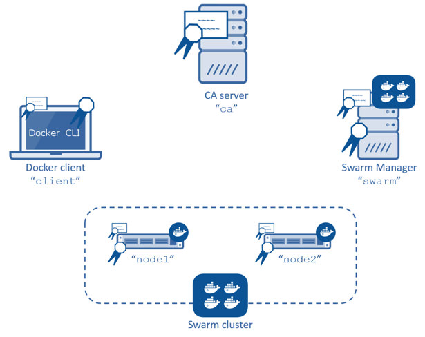
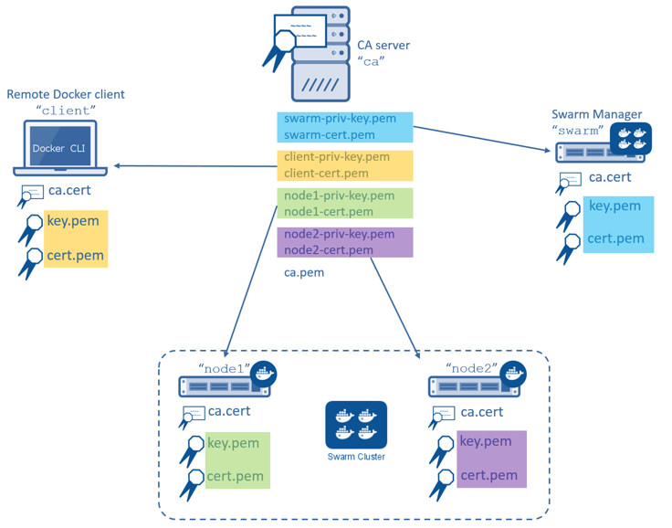

<!--[metadata]>
+++
title = "Configure Docker Swarm for TLS"
description = "Swarm and transport layer security"
keywords = ["docker, swarm, TLS, discovery, security,  certificates"]
[menu.main]
parent="workw_swarm"
weight=55
+++
<![end-metadata]-->

# Configure Docker Swarm for TLS

In this procedure you create a two-node Swarm cluster, a Docker Engine CLI, a
Swarm Manager, and a Certificate Authority as shown below. All the Docker Engine
hosts (`client`, `swarm`, `node1`, and `node2`) have a copy of the
CA's certificate as well as their own key-pair signed by the CA.



You will complete the following steps in this procedure:


- [Step 1: Set up the prerequisites](#step-1-set-up-the-prerequisites)
- [Step 2: Create a Certificate Authority (CA) server](#step-2-create-a-certificate-authority-ca-server)
- [Step 3: Create and sign keys](#step-3-create-and-sign-keys)
- [Step 4: Install the keys](#step-4-install-the-keys)
- [Step 5: Configure the Engine daemon for TLS](#step-5-configure-the-engine-daemon-for-tls)
- [Step 6: Create a Swarm cluster](#step-6-create-a-swarm-cluster)
- [Step 7: Create the Swarm Manager using TLS](#step-7-create-the-swarm-manager-using-tls)
- [Step 8: Test the Swarm manager configuration](#step-8-test-the-swarm-manager-configuration)
- [Step 9: Configure the Engine CLI to use TLS](#step-9-configure-the-engine-cli-to-use-tls)

### Before you begin
The article includes steps to create your own CA using OpenSSL. This is similar
to operating your own internal corporate CA and PKI. However, this `must not`
be used as a guide to building a production-worthy internal CA and PKI. These
steps are included for demonstration purposes only - so that readers without
access to an existing CA and set of certificates can follow along and configure
Docker Swarm to use TLS.


## Step 1: Set up the prerequisites

To complete this procedure you must stand up 5 (five) Linux servers. These
servers can be any mix of physical and virtual servers; they may be on premises
or in the public cloud. The following table lists each server name and its purpose.

| Server name | Description                                    |
|-------------|------------------------------------------------|
| `ca`      | Acts as the Certificate Authority (CA) server. |
| `swarm`   | Acts as the Swarm Manager.                     |
| `node1`   | Act as a Swarm node.                           |
| `node2`   | Act as a Swarm node.                           |
| `client`  | Acts as a remote Docker Engine client          |

Make sure that you have SSH access to all 5 servers and that they can communicate with each other using DNS name resolution. In particular:

- Open TCP port 2376 between the Swarm Manager and Swarm nodes
- Open TCP port 3376 between the Docker Engine client and the Swarm Manager

You can choose different ports if these are already in use. This example assumes
you use these ports though.

Each server must run an operating system compatible with Docker Engine. For
simplicity, the steps that follow assume all servers are running Ubuntu 14.04
LTS.

## Step 2: Create a Certificate Authority (CA) server

>**Note**:If you already have access to a CA and certificates, and are comfortable working with them, you should skip this step and go to the next.

In this step, you configure a Linux server as a CA. You use this CA to create
and sign keys. This step included so that readers without access to an existing
CA (external or corpoate) and certificates can follow along and complete the
later steps that require installing and using certificates. It is `not`
intended as a model for how to deploy production-worthy CA.

1. Logon to the terminal of your CA server and elevate to root.

        $ sudo su
        # 

2. Create a private key called `ca-priv-key.pem` for the CA:

        # openssl genrsa -out ca-priv-key.pem 2048
        Generating RSA private key, 2048 bit long modulus
        ...........................................................+++
        .....+++
        e is 65537 (0x10001)

3. Create a public key called `ca.pem` for the CA.

    The public key is based on the private key created in the previous step.

        # openssl req -config /usr/lib/ssl/openssl.cnf -new -key ca-priv-key.pem -x509 -days 1825 -out ca.pem
        You are about to be asked to enter information that will be incorporated
        into your certificate request.
        What you are about to enter is what is called a Distinguished Name or a DN.
        There are quite a few fields but you can leave some blank
        For some fields there will be a default value,
        If you enter '.', the field will be left blank.
        -----
        Country Name (2 letter code) [AU]:US
        <output truncated>

You have now configured a CA server with a public and private keypair. You can inspect the contents of each key. To inspect the private key:

```
# openssl rsa -in ca-priv-key.pem -noout -text
```

To inspect the public key (cert): `

```
# openssl x509 -in ca.pem -noout -text`
```

The following command shows the partial contents of the CA's public key.

    # openssl x509 -in ca.pem -noout -text
    Certificate:
        Data:
            Version: 3 (0x2)
            Serial Number: 17432010264024107661 (0xf1eaf0f9f41eca8d)
        Signature Algorithm: sha256WithRSAEncryption
            Issuer: C=US, ST=CA, L=Sanfrancisco, O=Docker Inc
            Validity
                Not Before: Jan 16 18:28:12 2016 GMT
                Not After : Jan 13 18:28:12 2026 GMT
            Subject: C=US, ST=CA, L=San Francisco, O=Docker Inc
            Subject Public Key Info:
                Public Key Algorithm: rsaEncryption
                    Public-Key: (2048 bit)
                    Modulus:
                        00:d1:fe:6e:55:d4:93:fc:c9:8a:04:07:2d:ba:f0:
                        55:97:c5:2c:f5:d7:1d:6a:9b:f0:f0:55:6c:5d:90:
    <output truncated>

Later, you'll use this to certificate to sign keys for other servers in the
infrastructure.

## Step 3: Create and sign keys

Now that you have a working CA, you need to create key pairs for the Swarm
Manager, Swarm nodes, and remote Docker Engine client. The commands and process
to create key pairs is identical for all servers.  You'll create the following keys:

<table>
  <tr>
    <th></th>
    <th></th>
  </tr>
  <tr>
    <td><code>ca-priv-key.pem</td>
    <td>The CA's private key and must be kept secure. It is used later to sign new keys for the other nodes in the environment. Together with the <code>ca.pem</code> file, this makes up the CA's key pair.</td>
  </tr>
  <tr>
    <td><code>ca.pem</td>
    <td>The CA's public key (also called certificate). This is installed on all nodes in the environment so that all nodes trust certificates signed by the CA. Together with the <code>ca-priv-key.pem</code> file, this makes up the CA's key pair.</td>
  </tr>
  <tr>
    <td><code><i>node</i>.csr</code></td>
    <td>A certificate signing request (CSR). A CSR is effectively an application to the CA to create a new key pair for a particular node. The CA takes the information provided in the CSR and generates the public and private key pair for that node.</td>
  </tr>
  <tr>
    <td><code><i>node</i>-priv.key</code></td>
    <td>A private key signed by the CA. The node uses this key to authenticate itself with remote Docker Engines. Together with the <code><i>node</i>-cert.pem</code> file, this makes up a node's key pair.</td>
  </tr>
  <tr>
    <td><code><i>node</i>-cert.pem</code></td>
    <td>A certificate signed by the CA. This is not used in this example. Together with the <code><i>node</i>-priv.key</code> file, this makes up a node's key pair</td>
  </tr>
</table>

The commands below show how to create keys for all of your nodes. You perform this procedure in a working directory located on your CA server.

1. Logon to the terminal of your CA server and elevate to root.

        $ sudo su

2. Create a private key `swarm-priv-key.pem` for your Swarm Manager

        # openssl genrsa -out swarm-priv-key.pem 2048
        Generating RSA private key, 2048 bit long modulus
        ............................................................+++
        ........+++
        e is 65537 (0x10001)

2. Generate a certificate signing request (CSR) `swarm.csr` using the private key you create in the previous step.

        # openssl req -subj "/CN=swarm" -new -key swarm-priv-key.pem -out swarm.csr

    Remember, this is only for demonstration purposes. The process to create a
    CSR will be slightly different in real-world production environments.

3. Create the certificate `swarm-cert.pem` based on the CSR created in the previous step.

        # openssl x509 -req -days 1825 -in swarm.csr -CA ca.pem -CAkey ca-priv-key.pem -CAcreateserial -out swarm-cert.pem -extensions v3_req -extfile /usr/lib/ssl/openssl.cnf
        <snip>
        # openssl rsa -in swarm-priv-key.pem -out swarm-priv-key.pem

   You now have a keypair for the Swarm Manager.

4. Repeat the steps above for the remaining nodes in your infrastructure (`node1`, `node2`, and `client`).

    Remember to replace the `swarm` specific values with the values relevant to the node you are creating the key pair for.

    <table>
    <tr>
    <th>Server name</th>
    <th>Private key</th>
    <th>CSR</th>
    <th>Certificate</th>
    </tr>
    <tr>
    <td><code>node1 </code></td>
    <td><code>node1-priv-key.pem</code></td>
    <td><code>node1.csr</code></td>
    <td><code>node1-cert.pem</code></td>
    </tr>
    <tr>
    <td><code>node2</code></td>
    <td><code>node2-priv-key.pem</code></td>
    <td><code>node2.csr</code></td>
    <td><code>node2-cert.pem</code></td>
    </tr>
    <tr>
    <td><code>client</code></td>
    <td><code>client-priv-key.pem</td>
    <td><code>client.csr</code></td>
    <td><code>client-cert.pem</code></td>
    </tr>
    </table>

5. Verify that your working directory contains the following files:

        # ls -l
        total 64
        -rw-r--r-- 1 root   root   1679 Jan 16 18:27 ca-priv-key.pem
        -rw-r--r-- 1 root   root   1229 Jan 16 18:28 ca.pem
        -rw-r--r-- 1 root   root     17 Jan 18 09:56 ca.srl
        -rw-r--r-- 1 root   root   1086 Jan 18 09:56 client-cert.pem
        -rw-r--r-- 1 root   root    887 Jan 18 09:55 client.csr
        -rw-r--r-- 1 root   root   1679 Jan 18 09:56 client-priv-key.pem
        -rw-r--r-- 1 root   root   1082 Jan 18 09:44 node1-cert.pem
        -rw-r--r-- 1 root   root    887 Jan 18 09:43 node1.csr
        -rw-r--r-- 1 root   root   1675 Jan 18 09:44 node1-priv-key.pem
        -rw-r--r-- 1 root   root   1082 Jan 18 09:49 node2-cert.pem
        -rw-r--r-- 1 root   root    887 Jan 18 09:49 node2.csr
        -rw-r--r-- 1 root   root   1675 Jan 18 09:49 node2-priv-key.pem
        -rw-r--r-- 1 root   root   1082 Jan 18 09:42 swarm-cert.pem
        -rw-r--r-- 1 root   root    887 Jan 18 09:41 swarm.csr
        -rw-r--r-- 1 root   root   1679 Jan 18 09:42 swarm-priv-key.pem

You can inspect the contents of each of the keys. To inspect a private key:

```
openssl rsa -in <key-name> -noout -text
```

To inspect a public key (cert):

```
openssl x509 -in <key-name> -noout -text
```

The following commands shows the partial contents of the Swarm Manager's public
 `swarm-cert.pem` key.

```
# openssl x509 -in ca.pem -noout -text
Certificate:
Data:
    Version: 3 (0x2)
    Serial Number: 9590646456311914051 (0x8518d2237ad49e43)
Signature Algorithm: sha256WithRSAEncryption
    Issuer: C=US, ST=CA, L=Sanfrancisco, O=Docker Inc
    Validity
        Not Before: Jan 18 09:42:16 2016 GMT
        Not After : Jan 15 09:42:16 2026 GMT
    Subject: CN=swarm

<output truncated>
```

## Step 4: Install the keys

In this step, you install the keys on the relevant servers in the
infrastructure. Each server needs three files:

- A copy of the Certificate Authority's public key (`ca.pem`)
- It's own private key
- It's own public key (cert)

The procedure below shows you how to copy these files from the CA server to each
server using `scp`. As part of the copy procedure, you'll rename each file as
follows on each node:

| Original name           | Copied name |
|-------------------------|-------------|
| `ca.pem`                | `ca.pem`    |
| `<server>-cert.pem`     | `cert.pem`  |
| `<server>-priv-key.pem` | `key.pem`   |

1. Logon to the terminal of your CA server and elevate to root.

        $ sudo su

2. Create a` ~/.certs` directory on the Swarm manager. Here we assume user account is ubuntu.

        $ ssh ubuntu@swarm 'mkdir -p /home/ubuntu/.certs'

2. Copy the keys from the CA to the Swarm Manager server.

        $ scp ./ca.pem ubuntu@swarm:/home/ubuntu/.certs/ca.pem
        $ scp ./swarm-cert.pem ubuntu@swarm:/home/ubuntu/.certs/cert.pem
        $ scp ./swarm-priv-key.pem ubuntu@swarm:/home/ubuntu/.certs/key.pem


    >**Note**: You may need to provide authentication for the `scp` commands to work. For example, AWS EC2 instances use certificate-based authentication. To copy the files to an EC2 instance associated with a public key called `nigel.pem`, modify the `scp` command as follows: `scp -i /path/to/nigel.pem ./ca.pem ubuntu@swarm:/home/ubuntu/.certs/ca.pem`.

3. Repeat step 2 for each remaining  server in the infrastructure.

    * `node1`
    * `node2`
    * `client`

4. Verify your work.

    When the copying is complete, each machine should have the following keys.

    

    Each node in your infrastructure should have the following files in the
    `/home/ubuntu/.certs/` directory:

        # ls -l /home/ubuntu/.certs/
        total 16
        -rw-r--r-- 1 ubuntu ubuntu 1229 Jan 18 10:03 ca.pem
        -rw-r--r-- 1 ubuntu ubuntu 1082 Jan 18 10:06 cert.pem
        -rw-r--r-- 1 ubuntu ubuntu 1679 Jan 18 10:06 key.pem

## Step 5: Configure the Engine daemon for TLS

In the last step, you created and installed the necessary keys on each of your
Swarm nodes. In this step, you configure them to listen on the network and only
accept connections using TLS. Once you complete this step, your Swarm nodes will
listen on TCP port 2376, and only accept connections using TLS.

On `node1` and `node2` (your Swarm nodes), do the following:

1. Open a terminal on `node1` and elevate to root.

        $ sudo su

2. Edit Docker Engine configuration file.

    If you are following along with these instructions and using Ubuntu 14.04
    LTS, the configuration file is `/etc/default/docker`. The Docker Engine
    configuration file may be different depending on the Linux distribution you
    are using.

3. Add the following options to the `DOCKER_OPTS` line.

         -H tcp://0.0.0.0:2376 --tlsverify --tlscacert=/home/ubuntu/.certs/ca.pem --tlscert=/home/ubuntu/.certs/cert.pem --tlskey=/home/ubuntu/.certs/key.pem

2. Restart the Docker Engine daemon.

         $ service docker restart

3. Repeat the procedure on `node2` as well.


## Step 6: Create a Swarm cluster

Next create a Swarm cluster. In this procedure you create a two-node Swarm
cluster using the default *hosted discovery* backend. The default hosted
discovery backend uses Docker Hub and is not recommended for production use.


1. Logon to the terminal of your Swarm manager node.

2. Create the cluster and export it's unique ID to the `TOKEN` environment variable.

        $ sudo export TOKEN=$(docker run --rm swarm create)
        Unable to find image 'swarm:latest' locally
        latest: Pulling from library/swarm
        d681c900c6e3: Pulling fs layer
        <snip>
        986340ab62f0: Pull complete
        a9975e2cc0a3: Pull complete
        Digest: sha256:c21fd414b0488637b1f05f13a59b032a3f9da5d818d31da1a4ca98a84c0c781b
        Status: Downloaded newer image for swarm:latest

3. Join `node1` to the cluster.

    Be sure to specify TCP port `2376` and not `2375`.

        $ sudo docker run -d swarm join --addr=node1:2376 token://$TOKEN
        7bacc98536ed6b4200825ff6f4004940eb2cec891e1df71c6bbf20157c5f9761

4. Join `node2` to the cluster.

        $ sudo docker run -d swarm join --addr=node2:2376 token://$TOKEN
        db3f49d397bad957202e91f0679ff84f526e74d6c5bf1b6734d834f5edcbca6c


## Step 7: Start the Swarm Manager using TLS

1. Launch a new container with TLS enables

        $ docker run -d -p 3376:3376 -v /home/ubuntu/.certs:/certs:ro swarm manage --tlsverify --tlscacert=/certs/ca.pem --tlscert=/certs/cert.pem --tlskey=/certs/key.pem --host=0.0.0.0:3376 token://$TOKEN

    The command above launches a new container based on the `swarm` image
    and it maps port `3376` on the server to port `3376` inside the
    container. This mapping ensures that Docker Engine commands sent to the host
    on port `3376` are passed on to port `3376` inside the container. The
    container runs the Swarm `manage` process with the `--tlsverify`,
    `--tlscacert`, `--tlscert` and `--tlskey` options specified. These options
    force TLS verification and specify the location of the Swarm manager's TLS
    keys.

2. Run a `docker ps` command to verify that your Swarm manager container is up
and running.

        $ docker ps
        CONTAINER ID   IMAGE               COMMAND                  CREATED          STATUS          PORTS                              NAMES
        035dbf57b26e   swarm               "/swarm manage --tlsv"   7 seconds ago    Up 7 seconds    2375/tcp, 0.0.0.0:3376->3376/tcp   compassionate_lovelace

Your Swarm cluster is now configured to use TLS.

## Step 8: Test the Swarm manager configuration

Now that you have a Swarm cluster built and configured to use TLS, you'll test that it works with a Docker Engine CLI.

1. Open a terminal onto your `client` server.

2. Issue the `docker version` command.

    When issuing the command, you must pass it the location of the clients certifications.

        $ sudo docker --tlsverify --tlscacert=/home/ubuntu/.certs/ca.pem --tlscert=/home/ubuntu/.certs/cert.pem --tlskey=/home/ubuntu/.certs/key.pem -H swarm:3376 version
        Client:
         Version:      1.9.1
         API version:  1.21
         Go version:   go1.4.2
         Git commit:   a34a1d5
         Built:        Fri Nov 20 13:12:04 UTC 2015
         OS/Arch:      linux/amd64

        Server:
         Version:      swarm/1.0.1
         API version:  1.21
         Go version:   go1.5.2
         Git commit:   744e3a3
         Built:
         OS/Arch:      linux/amd64

    The output above shows the `Server` version as "swarm/1.0.1". This means
    that the command was successfully issued against the Swarm manager.

2. Verify that the same command does not work without TLS.

    This time, do not pass your certs to the Swarm manager.

        $ sudo docker -H swarm:3376 version
        :
         Version:      1.9.1
         API version:  1.21
         Go version:   go1.4.2
         Git commit:   a34a1d5
         Built:        Fri Nov 20 13:12:04 UTC 2015
         OS/Arch:      linux/amd64
        Get http://swarm:3376/v1.21/version: malformed HTTP response "\x15\x03\x01\x00\x02\x02".
        * Are you trying to connect to a TLS-enabled daemon without TLS?

    The output above shows that the command was rejected by the server. This is
    because the server (Swarm manager) is configured to only accept connections
    from authenticated clients using TLS.


## Step 9: Configure the Engine CLI to use TLS

You can configure the Engine so that you don't have to pass the TLS options when
you issue a command. To do this, you'll configure the `Docker Engine host` and
`TLS` settings as defaults on your Docker Engine client.

To do this, you place the client's keys in your `~/.docker` configuration folder. If you have other users on your system using the Engine command line, you'll need to configure their account's `~/.docker` as well. The procedure below shows how to do this for the `ubuntu` user on
your Docker Engine client.

1. Open a terminal onto your `client` server.

2. If it doesn't exist, create a `.docker` directory in the `ubuntu` user's home directory.

        $ mkdir /home/ubuntu/.docker

4. Copy the Docker Engine client's keys from `/home/ubuntu/.certs` to
`/home/ubuntu/.docker`

        $ cp /home/ubuntu/.certs/{ca,cert,key}.pem /home/ubuntu/.docker

5. Edit the account's `~/.bash_profile`.

6. Set the following variables:

    <table>
    <tr>
    <th>Variable</th>
    <th>Description</th>
    </tr>
    <tr>
    <td><code>DOCKER_HOST</code></td>
    <td>Sets the Docker host and TCP port to send all Engine commands to.</td>
    </tr>
    <tr>
    <td><code>DOCKER_TLS_VERIFY</code></td>
    <td>Tell's Engine to use TLS.</td>
    </tr>
    <tr>
    <td><code>DOCKER_CERT_PATH</code></td>
    <td>Specifies the location of TLS keys.</td>
    </tr>
    </table>

    For example:

            export DOCKER_HOST=tcp://swarm:3376
            export DOCKER_TLS_VERIFY=1
            export DOCKER_CERT_PATH=/home/ubuntu/.docker/

6. Save and close the file.

7. Source the file to pick up the new variables.

            $ source ~/.bash_profile

8. Verify that the procedure worked by issuing a `docker version` command

        $ docker version
        Client:
         Version:      1.9.1
         API version:  1.21
         Go version:   go1.4.2
         Git commit:   a34a1d5
         Built:        Fri Nov 20 13:12:04 UTC 2015
         OS/Arch:      linux/amd64

        Server:
         Version:      swarm/1.0.1
         API version:  1.21
         Go version:   go1.5.2
         Git commit:   744e3a3
         Built:
         OS/Arch:      linux/amd64

    The server portion of the output above command shows that your Docker
    client is issuing commands to the Swarm Manager and using TLS.

Congratulations! You have configured a Docker Swarm cluster to use TLS.

## Related Information

* [Secure Docker Swarm with TLS](secure-swarm-tls.md)
* [Docker security](https://docs.docker.com/engine/security/security/)
