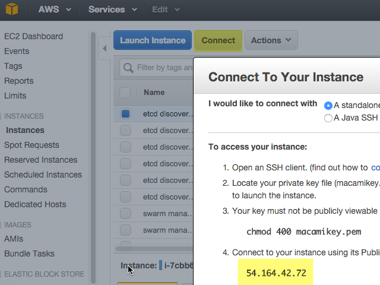

<!--[metadata]>
+++
title = "Getting started with Docker Swarm on cloud services"
description = "Deploying Swarm on AWS EC2 AMI's"
keywords = ["docker, swarm, clustering, examples, Amazon, AWS EC2"]
[menu.main]
parent="workw_swarm"
+++
<![end-metadata]-->

# Swarm get started (network pro)

This example shows you how to deploy a high-availability Docker Swarm cluster on  Amazon Web Services (AWS). You'll use Docker Engine on Elastic Cloud (EC2) instances on a Virtual Private Cloud (VPC). Then you'll deploy Swarm managers and nodes to those hosts. During this process you'll implement basic network security and set up a discovery backend. Finally, you'll deploy a container on your Swarm cluster and learn how high-availability works when one of the managers or nodes goes down.

For a gentler introduction to Swarm, try the [Swarm get started (novice)](https://docs.docker.com/swarm/install-w-machine/) page.

<There are different ways to deploy a Swarm. This topic shows you how to do it ***without using Docker Machine***. For more information about using Docker Machine in a scenario like this one, see: TBD>

<This example doesn't use Amazon's EC2 Container Service (ECS)>

## Prerequisites

- An Amazon Web Services (AWS) account
- Familiarity with the location of AWS features, such as:
  - EC2 Virtual Servers in the Cloud
  - Virtual Private Cloud (VPC)
  - VPC Security groups
  - Creating SSH keys and using them to to connect to an EC2 instance

## Step 1: Create an AMI that has Docker Engine  

1. Log in to your Amazon AWS account and open the Home Console.

2. Open the EC2 Dashboard and create an instance using the *Amazon Linux AMI*.

4. Connect to the instance using SSH.

5. Install Docker Engine on the instance [using these  instructions](https://docs.docker.com/engine/installation/rhel/#install-with-the-script).

    Use the `sudo usermod -aG docker ec2-user` command mentioned by the command line output, followed by `logout`.
    > If your Swarm is going to use TLS authentication, you can set up TLS now before creating the AMI image. If you're using self-signed certificates, you can add one to the instance now.   

6. Create an AMI image of your instance named something like "AL-AMI running Docker Engine 1.10".

    

## Create two instances for Swarm managers

In the EC2 Dashboard, click *Launch Instance*.

For *Step 1. Choose AMI Image*,  click the tab for *My AMIs*, and select your AMI, "AL-AMI running Docker Engine".

On *Step 3: Configure Instance Details*, set "Number of Instances" to `2`.

On *Step 5: Tag Instance*, set the `Value` of `Name` to "Swarm manager".

On *Step 6: Configure Security Group*, Use `Create a new security group` to create one called "Swarm managers". Add the following Inbound rules to it:

| Type             | Protocol   | Port Range | Source        |
| ---------------  | -----      | -----      | -----         |
| SSH              | TCP        | 22         | 0.0.0.0/0     |
| HTTP             | TCP        | 80         | 0.0.0.0/0     |
| Custom TCP Rule  | TCP        | 2375       | 172.30.0.0/24 |
| Custom TCP Rule  | TCP        | 3375       | 172.30.0.0/24 |
| Custom TCP Rule  | TCP        | 4000       | 172.30.0.0/24 |

Then, launch the instances!

## Create two instances for Swarm nodes

Return to the EC2 Dashboard and launch two instances.  

On *Step 5: Tag Instance*, set the `Value` of `Name` to "Swarm node".

On *Step 6: Configure Security Group*, choose "Create a new security group".

Name the security group "Swarm nodes" and add the following Inbound rules to it:

| Type             | Protocol   | Port Range | Source        |
| ---------------  | -----      | -----      | -----         |
| SSH              | TCP        | 22         | 0.0.0.0/0     |
| HTTP             | TCP        | 80         | 0.0.0.0/0     |
| Custom TCP Rule  | TCP        | 2375       | 172.30.0.0/24 |

Optional: You can also edit the settings of the first EC2 instance you created (the one you used to create the AMI) to become a Swarm node.

## Create three instances for etcd discovery backend

Return to the EC2 Dashboard and launch three instances.  

On *Step 5: Tag Instance*, set the `Value` of `Name` to "etcd discovery backend".

On *Step 6: Configure Security Group*, choose "Create a new security group".

Name the security group "etcd discovery backend" and add the following Inbound rules to it:

| Type             | Protocol   | Port Range | Source        |
| ---------------  | -----      | -----      | -----         |
| SSH              | TCP        | 22         | 0.0.0.0/0     |
| Custom TCP Rule  | TCP        | 4001       | 172.30.0.0/24 |
| Custom TCP Rule  | TCP        | 2380       | 172.30.0.0/24 |
| Custom TCP Rule  | TCP        | 2379       | 172.30.0.0/24 |

## Some notes about security and high availability

The security groups shown above are purely for example. For a production environment, consult a network security expert. That person may apply more restrictive settings to your security groups, apply a Network Access Control List (NACL), and use other strategies not mentioned here.

For high-availability, you can deploy instances over multiple failure domains. For example, you can deploy the instances across multiple AWS availability zones for your Region. Consult with an expert or study Amazon's documentation on this subject.

## Set up a etcd discovery backend

Here, you're going to create a high-availability discovery backend for Swarm. You're going to use containers to deploy three etcd nodes to three separate EC2 instances running Docker Engine.

To start, copy all three of the following following launch commands to a text file. Then, find and replace the <ip0>, <ip1>, <ip2> placeholders with the publicly visible IP addresses of the three EC2 instances.

> To get the IP address, go to EC2 Dashboard > Instances, select an instance, and click the Connect button. This displays the IP address in Connect to Your Instance window.

When you've finished editing the following launch commands, connect to each  of the three instances and use the command to launch an etcd node.

        ### etcd0 launch command

        docker run -d -p 4001:4001 -p 2380:2380 -p 2379:2379 --name etcd quay.io/coreos/etcd:v2.0.3 \
         -name etcd0 \
         -advertise-client-urls http://<ip0>:2379,http://<ip0>:4001 \
         -listen-client-urls http://0.0.0.0:2379,http://0.0.0.0:4001 \
         -initial-advertise-peer-urls http://<ip0>:2380 \
         -listen-peer-urls http://0.0.0.0:2380 \
         -initial-cluster-token etcd-cluster-1 \
         -initial-cluster etcd0=http://<ip0>:2380,etcd1=http://<ip1>:2380,etcd2=http://<ip2>:2380 \
         -initial-cluster-state new

        ### etcd1 launch command

        docker run -d -p 4001:4001 -p 2380:2380 -p 2379:2379 --name etcd quay.io/coreos/etcd:v2.0.3 \
         -name etcd1 \
         -advertise-client-urls http://<ip1>:2379,http://<ip1>:4001 \
         -listen-client-urls http://0.0.0.0:2379,http://0.0.0.0:4001 \
         -initial-advertise-peer-urls http://<ip1>:2380 \
         -listen-peer-urls http://0.0.0.0:2380 \
         -initial-cluster-token etcd-cluster-1 \
         -initial-cluster etcd0=http://<ip0>:2380,etcd1=http://<ip1>:2380,etcd2=http://<ip2>:2380 \
         -initial-cluster-state new

        ### etcd2 launch command

        docker run -d -p 4001:4001 -p 2380:2380 -p 2379:2379 --name etcd quay.io/coreos/etcd:v2.0.3 \
         -name etcd2 \
         -advertise-client-urls http://<ip2>:2379,http://<ip2>:4001 \
         -listen-client-urls http://0.0.0.0:2379,http://0.0.0.0:4001 \
         -initial-advertise-peer-urls http://<ip2>:2380 \
         -listen-peer-urls http://0.0.0.0:2380 \
         -initial-cluster-token etcd-cluster-1 \
         -initial-cluster etcd0=http://<ip0>:2380,etcd1=http://<ip1>:2380,etcd2=http://<ip2>:2380 \
         -initial-cluster-state new

<For more information about configuring etcd this way, see https://coreos.com/etcd/docs/2.0.9/docker_guide.html#running-a-3-node-etcd-cluster>

## Create the Swarm managers

After you've created the discovery backend, you can create Swarm managers that use the backend.

Using an SSH terminal window, connect to one of the instances named "Swarm manager".

For a solo Swarm manager, you would use the following command.

        docker run -d -p <manager_port>:2375 swarm manage etcd://<ip1>,<ip2>,<ip2>

Where `<manager_port>`is the port number the manager is listening on, and `<ip1>,<ip2>,<ip2>` are the IP addresses of the etcd servers. For example:

        docker run -d -p 54.86.51.147:2375 swarm manage etcd://54.164.42.72:2380,54.172.65.234:2380,54.165.237.251:2380

To start the primary manager in a high-availability Swarm cluster use the `--replication` and `--advertise` flags, like this:

        docker swarm manage -H :4000 <tls-config-flags> --replication --advertise <manager1_ip_address>:4000 etcd://<ip1>,<ip2>,<ip2>

For example:

        docker swarm manage -H :4000 --replication --advertise 54.86.51.147:4000  etcd://54.164.42.72:2380,54.172.65.234:2380,54.165.237.251:2380
        INFO[0000] Listening for HTTP addr=:4000 proto=tcp
        INFO[0000] Cluster leadership acquired
        INFO[0000] New leader elected: 192.168.42.200:4000
        [...]

<We need to clarify the other differences in syntax - and the use of port 4000 versus 2375 >

#####OPEN ITEMS _ REVISE AND MIGRATE OR REMOVE THE FOLLOWING SUBSECTIONS
The following items are placeholders for topics that we might incorporate...

### About Backends
The etcd backend is just one of the discovery backends you can use. For more information, see the [https://docs.docker.com/swarm/discovery/](Discovery) topic. Here is a list of the alternative discovery syntax to use in the following commands.

        token://<token>
        consul://<ip>/<path>
        etcd://<ip1>,<ip2>/<path>
        file://path/to/file
        zk://<ip1>,<ip2>/<path>
        [nodes://]<ip1>,<ip2>

### Using TLS with Swarm

Swarm supports TLS authentication between the Docker Client, Swarm, and the Docker nodes. Use the same CA-certificate to sign all of the Docker daemon certificates and client certificates.

One approach is to

To enable TLS for both client and server, you can specify the same command line options as with Docker Engine:

swarm manage --tlsverify --tlscacert=<CACERT> --tlscert=<CERT> --tlskey=<KEY> [...]

Please refer to the [Docker documentation](https://github.com/moxiegirl/swarm/blob/securing-swarm/docs/configure-tls.md) for more information on how to set up TLS authentication on Docker Engine and generating the certificates.

Note: Swarm certificates must be generated with `extendedKeyUsage = clientAuth,serverAuth`.

### Talk about ports
Open ports
Talk about port options
Specific discussion of difference between ports 2375, 2376 and 3375/6

## Connect to the Swarm master and deploy a container on a swarm
Explain the relationship via text/diagram
Illustrate via command-line examples how to do this
Leverage portions of getting started (novice) example.

## More resources

- Deploying a Swarm cluster on AWS raises the question of whether to add more EC2 instances or increase the CPU/RAM of each instance. Nati Shalom sheds light on this complex question in his [http://natishalom.typepad.com/nati_shaloms_blog/2010/09/scale-up-vs-scale-out.html](Scale-out vs Scale-up) blog post.
- Check out Mike Goelzer's [https://github.com/mgoelzer/swarm-demo-voting-app](Swarm Example Cluster: Web App) on GitHub.
