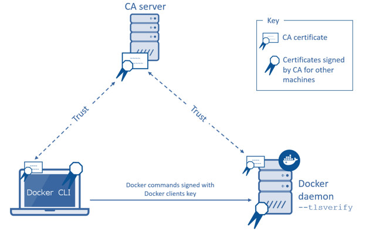

All nodes in a Swarm cluster must bind their Docker daemons to a network port.
This has obvious security implications. These implications are compounded when
the network in question is untrusted such as the internet. To mitigate these
risks, Docker Swarm and the Docker Engine daemon support Transport Layer Security
(TLS).

> **Note**: TLS is the successor to SSL (Secure Sockets Layer) and the two
> terms are often used interchangeably. Docker uses TLS, this
> term is used throughout this article.

## Learn the TLS concepts

Before going further, it is important to understand the basic concepts of TLS
and public key infrastructure (PKI).

Public key infrastructure is a combination of security related technologies,
policies, and procedures, that are used to create and manage digital
certificates. These certificates and infrastructure secure digital
communication using mechanisms such as authentication and encryption.

The following analogy may be useful. It is common practice that passports are
used to verify an individual's identity. Passports usually contain a photograph
and biometric information that identify the owner. A passport also lists the
country that issued it, as well as *valid from* and *valid to* dates. Digital
certificates are very similar. The text below is an extract from a digital
certificate:

```
Certificate:
Data:
    Version: 3 (0x2)
    Serial Number: 9590646456311914051 (0x8518d2237ad49e43)
Signature Algorithm: sha256WithRSAEncryption
    Issuer: C=US, ST=CA, L=Sanfrancisco, O=Docker Inc
    Validity
        Not Before: Jan 18 09:42:16 2016 GMT
        Not After : Jan 15 09:42:16 2026 GMT
    Subject: CN=swarm
```

This certificate identifies a computer called **swarm**. The certificate is valid between January 2016 and January 2026 and was issued by Docker Inc. based in the state of California in the US.

Just as passports authenticate individuals as they board flights and clear
customs, digital certificates authenticate computers on a network.

Public key infrastructure (PKI) is the combination of technologies, policies,
and procedures that work behind the scenes to enable digital certificates. Some
of the technologies, policies, and procedures provided by PKI include:

- Services to securely request certificates
- Procedures to authenticate the entity requesting the certificate
- Procedures to determine the entity's eligibility for the certificate
- Technologies and processes to issue certificates
- Technologies and processes to revoke certificates

## How does Docker Engine authenticate using TLS

This section shows how Docker Engine and Swarm use PKI and
certificates to increase security.

<!--[metadata]>Need to know about encryption too<![end-metadata]-->

You can configure both the Docker Engine CLI and the Docker Engine daemon to require
TLS for authentication. Configuring TLS means that all communications between
the Docker Engine CLI and the Docker Engine daemon must be accompanied with, and signed by a
trusted digital certificate. The Docker Engine CLI must provide its digital certificate
before the Docker Engine daemon accepts incoming commands from it.

The Docker Engine daemon must also trust the certificate that the Docker Engine CLI uses.
This trust is usually established by way of a trusted third party. The Docker Engine
CLI and Docker Engine daemon in the diagram below are configured to require TLS
authentication.



The trusted third party in this diagram is the Certificate Authority (CA)
server. Like the country in the passport example, a CA creates, signs, issues,
revokes certificates. Trust is established by installing the CA's root
certificate on the host running the Docker Engine daemon. The Docker Engine CLI then requests
its own certificate from the CA server, which the CA server signs and issues to
the client.

The Docker Engine CLI sends its certificate to the Docker Engine daemon before issuing
commands. The Docker Engine daemon inspects the certificate, and because the Docker Engine daemon trusts the CA,
the Docker Engine daemon automatically trusts any certificates signed by the CA. Assuming the
certificate is in order (the certificate has not expired or been revoked etc.)
the Docker Engine daemon accepts commands from this trusted Docker Engine CLI.

The Docker Engine CLI is simply a client that uses the Docker Engine API to
communicate with the Docker Engine daemon. Any client that uses this Docker Engine API can use
TLS. For example, Docker Engine clients such as 'Docker Universal Control Plane'
(UCP) have TLS support built-in. Other, third party products, that use Docker Engine
API, can also be configured this way.

## TLS modes with Docker and Swarm

Now that you know how certificates are used by the Docker Engine daemon for authentication,
it's important to be aware of the three TLS configurations possible with Docker
Engine daemon and its clients:

- External 3rd party CA
- Internal corporate CA
- Self-signed certificates

These configurations are differentiated by the type of entity acting as the Certificate Authority (CA).

### External 3rd party CA

An external CA is a trusted 3rd party company that provides a means of creating,
issuing, revoking, and otherwise managing certificates. They are *trusted* in
the sense that they need to fulfill specific conditions and maintain high levels
of security and business practices to win your business. You also need to
install the external CA's root certificates for you computers and services to
*trust* them.

When you use an external 3rd party CA, they create, sign, issue, revoke and
otherwise manage your certificates. They normally charge a fee for these
services, but are considered an enterprise-class scalable solution that
provides a high degree of trust.

### Internal corporate CA

Many organizations choose to implement their own Certificate Authorities and
PKI. Common examples are using OpenSSL and Microsoft Active Directory. In this
case, your company is its own Certificate Authority with all the work it
entails. The benefit is, as your own CA, you have more control over your PKI.

Running your own CA and PKI requires you to provide all of the services offered
by external 3rd party CAs. These include creating, issuing, revoking, and
otherwise managing certificates. Doing all of this yourself has its own costs
and overheads. However, for a large corporation, it still may reduce costs in
comparison to using an external 3rd party service.

Assuming you operate and manage your own internal CAs and PKI properly, an
internal, corporate CA can be a highly scalable and highly secure option.

### Self-signed certificates

As the name suggests, self-signed certificates are certificates that are signed
with their own private key rather than a trusted CA. This is a low cost and
simple to use option. If you implement and manage self-signed certificates
correctly, they can be better than using no certificates.

Because self-signed certificates lack of a full-blown PKI, they do not scale
well and lack many of the advantages offered by the other options. One of their
disadvantages is that you cannot revoke self-signed certificates. Due to this, and
other limitations, self-signed certificates are considered the least secure of
the three options. Self-signed certificates are not recommended for public
facing production workloads exposed to untrusted networks.

## Related information

* [Configure Docker Swarm for TLS](configure-tls.md)
* [Docker security](../engine/security/security.md)
