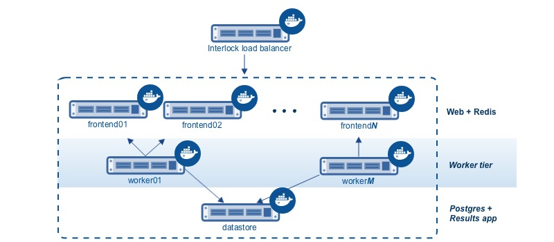
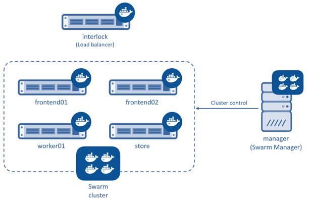
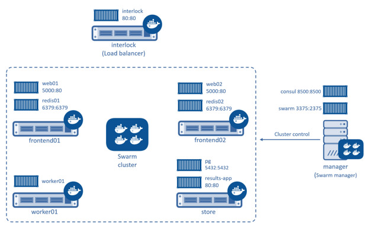

<!--[metadata]>
+++
title = "Learn the application architecture"
description = "Try Swarm at scale"
keywords = ["docker, swarm, scale, voting, application, archiecture"]
[menu.main]
parent="scale_swarm"
weight=-99
+++
<![end-metadata]-->

# Learn the application architecture

On this page, you learn about the Swarm at scale example.  Make sure you have
read through [the introduction](index.md) to get an idea of the skills and time
required first.

## Learn the example back story

Your company is a pet food company that has bought a commercial during the
Superbowl. The commercial drives viewers to a web survey that asks users to vote
&ndash; cats or dogs. You are developing the web survey.

Your survey must ensure that millions of people can vote concurrently without
your website becoming unavailable. You don't need real-time results, a company
press release announces the results. However, you do need confidence that every
vote is counted.

## Understand the application architecture

The voting application is a dockerized microservice application. It uses a
parallel web frontend that sends jobs to asynchronous background workers. The
application's design can accommodate arbitrarily large scale. The diagram below
shows the high level architecture of the application.

The application is fully dockerized with all services running inside of
containers.

The frontend consists of an Interlock load balancer with *N* frontend web
servers and associated queues. The load balancer can handle an arbitrary number
of web containers behind it (`frontend01`- `frontendN`). The web containers run
a simple Python Flask application. Each web container accepts votes and queues
them to a Redis container on the same node. Each web container and Redis queue
pair operates independently.  

The load balancer together with the independent pairs allows the entire
application to scale to an arbitrary size as needed to meet demand.

Behind the frontend is a worker tier which runs on separate nodes. This tier:

* scans the Redis containers
* dequeues votes
* deduplicates votes to prevent double voting
* commits the results to a Postgres container running on a separate node

Just like the front end, the worker tier can also scale arbitrarily. The worker
count and frontend count are independent from each other.

## Swarm Cluster Architecture

To support the application, the design calls for a Swarm cluster with a single
Swarm manager and four nodes as shown below.

All four nodes in the cluster are running the Docker daemon, as is the Swarm
manager and the Interlock load balancer. The Swarm manager exists on a Docker
Engine host that is part of the cluster and is considered out of band for
the application. The Interlock load balancer could be placed inside of the
cluster, but for this demonstration it is not.

A container network is overlayed on top of the Swarm cluster using the container
overlay feature of Docker engine. The dockerized microservices are deployed to
this network.  After completing the example and deploying your application, this
is what your environment should look like.

As the previous diagram shows, each node in the cluster runs the following containers:

- `frontend01`:
    - Container: Python flask web app (frontend01)
    - Container: Redis (redis01)
- `frontend02`:
    - Container: Python flask web app (frontend02)
    - Container: Redis (redis02)
- `worker01`: vote worker app (worker01)
- `store`:
    - Container: Postgres (pg)
    - Container: results app (results-app)

After you deploy the application, you'll configure your local system so that you
can test the application from your local browser. In production, of course, this
step wouldn't be needed.

## The network infrastructure

The example assumes you are deploying the application to a Docker Swarm cluster
running on top of Amazon Web Services (AWS). AWS is an example only. There is
nothing about this application or deployment that requires it. You could deploy
the application to a Docker Swarm cluster running on; a different cloud provider
such as Microsoft Azure, on premises in your own physical data center, or in a
development environment on your laptop.

## Next step

Now that you understand the application architecture, you need to deploy a
network configuration that can support it. In the next step, you use AWS to
[deploy network infrastructure](02-deploy-infra.md) for use in this sample.
