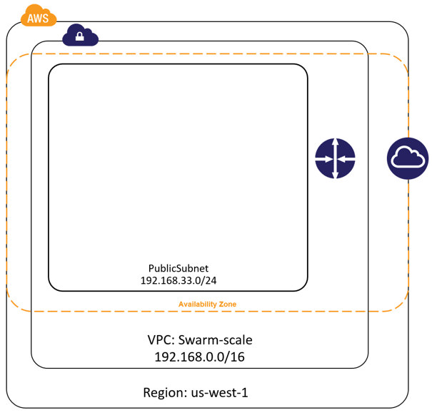
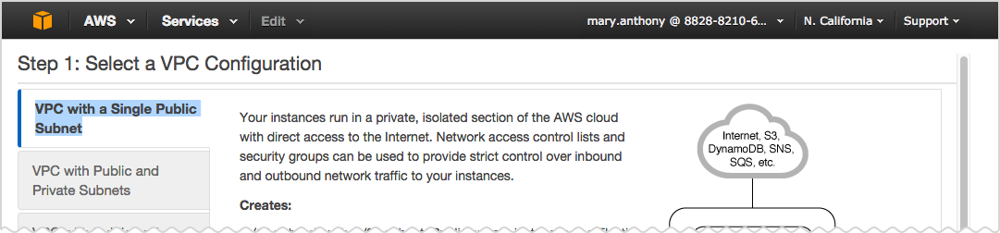
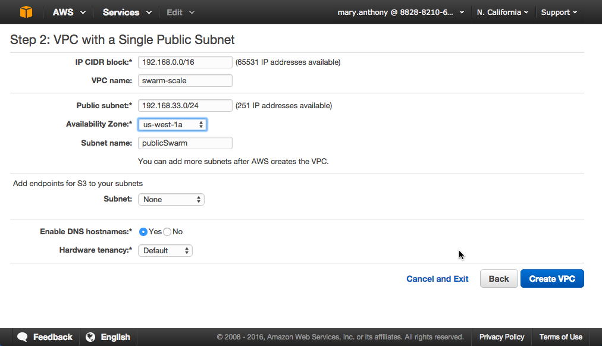
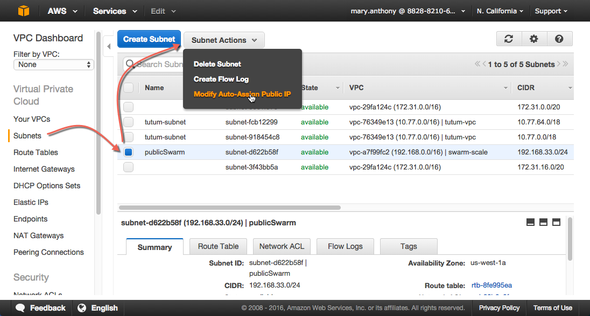
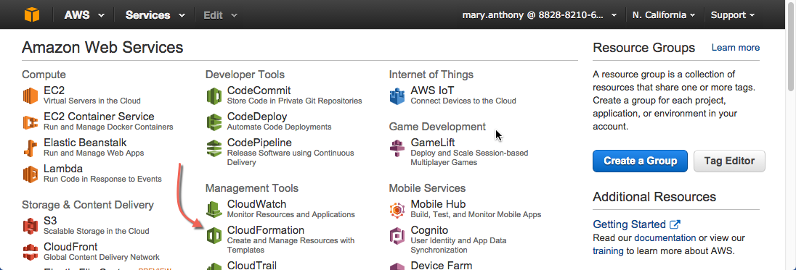
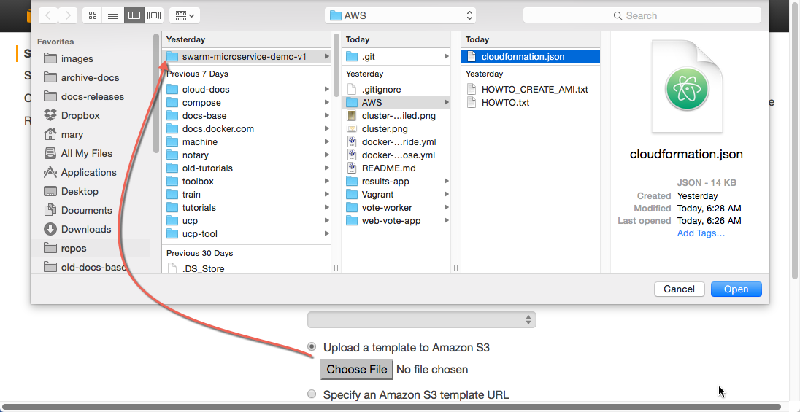
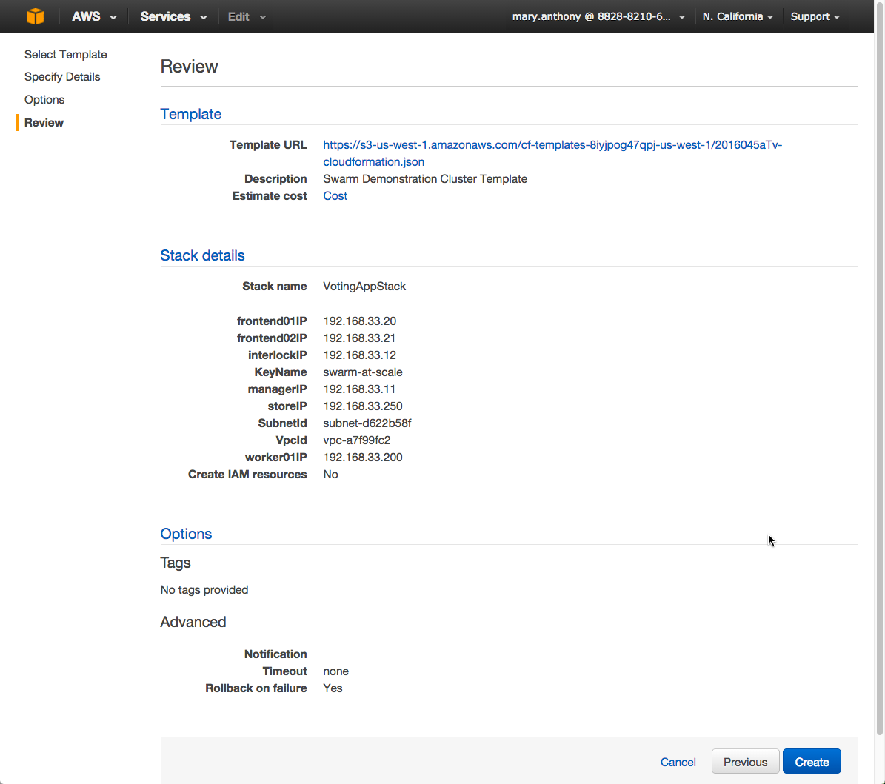
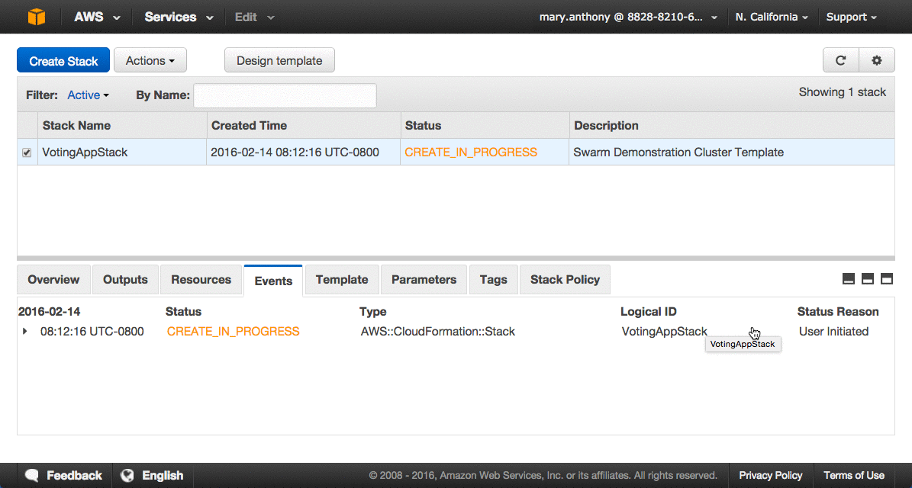
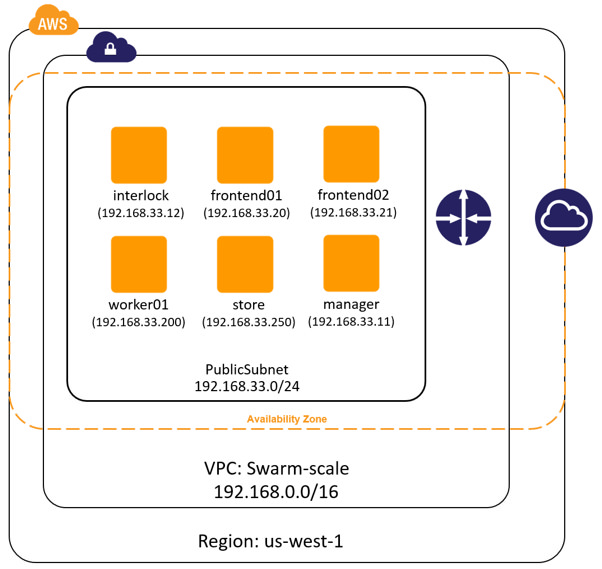

<!--[metadata]>
+++
title = "Deploy network infrastructure"
description = "Try Swarm at scale"
keywords = ["docker, swarm, scale, voting, application,  certificates"]
[menu.main]
parent="scale_swarm"
weight=-90
+++
<![end-metadata]-->

# Deploy your infrastructure

In this step, you create an AWS Virtual Private Cloud (VPC) to run your
application stack on. Before you continue, make sure you have taken the time to
[learn the application architecture](01-about.md).

This example uses AWS but the AWS provider is only one example of an
infrastructure you can use. You can create the environment design on whatever
infrastructure you wish. For example, you could place the application on another
public cloud platform such as Azure or DigitalOcean, on premises in your data
center, or even in in a test environment on your laptop.

>**Note**: If you are not deploying to AWS, or are not using the CloudFormation
template used in the instructions below, make sure your Docker hosts are running
a 3.16 or higher kernel. This kernel is required by Docker's container
networking feature.

## Overview of the deployment process

To deploy on an AWS infrastructure, you first build a VPC and then apply apply
the [CloudFormation template](https://github.com/docker/swarm-microservice-demo-v1/blob/master/AWS/cloudformation.json) prepared for you. The template describes the hosts in the example's stack. While you
could create the entire VPC and all instances via a CloudFormation template,
splitting the deployment into two steps lets you use the CloudFormation template
to build the stack on an *existing VPCs*.

The diagram below shows the VPC infrastructure required to run the
CloudFormation template.



The configuration is a single VPC with a single public subnet. The VPC
deployment relies on a <a
href="https://raw.githubusercontent.com/docker/swarm-microservice-demo-v1/master/AWS/cloudformation.json">cloudformation.json
template</a> which specifies in the `us-west-1` Region (N. California) or
`us-west-2` (Oregon). The ability to create instances one of these regions is
**required** for this particular CloudFormation template to work. If you want to
use a different region, edit the template before the import step.

The VPC network address space is `192.168.0.0/16` and single 24-bit public
subnet is carved out as 192.168.33.0/24. The subnet must be configured with a
default route to the internet via the VPC's internet gateway. All six EC2
instances are deployed into this public subnet.

Once the VPC is created, you deploy the EC2 instances using the
CloudFormation template located
[in the `docker/swarm-microservice-demo-v1` repository](https://github.com/docker/swarm-microservice-demo-v1/blob/master/AWS/cloudformation.json).

## Prerequisites

You'll need to have an Amazon AWS account. This account can be personal or
through a corporate instance. The account must be able to deploy EC2 instances
in the `us-west-1` region (N. California).

Before starting through this procedure, make sure you have an existing EC2 key
pair in the `us-west-1` region and that you have download its `.pem` file.  If
you aren't sure, login into AWS. Then, <a
href="http://docs.aws.amazon.com/AWSEC2/latest/UserGuide/ec2-key-pairs.html"
target="_blank">follow the AWS documentation</a> to ensure you have the key pair
and have downloaded the `.pem` file.

Git clone the <a href="https://github.com/docker/swarm-microservice-demo-v1"
target="_blank">example application's GitHub repo</a> to your local machine. If
you prefer, you can instead [download a `zip`
file](https://github.com/docker/swarm-microservice-demo-v1/archive/master.zip)
and unzip the code in your local environment.

## Step 1. Build and configure the VPC

This step shows you using the VPC wizard on Amazon. If you prefer to build the
VPC manually, configure your VPC with the following values:

| Field                     | Value                                                                                          |
|---------------------------|------------------------------------------------------------------------------------------------|
| **VPC Network (CIDR)**    | 192.168.0.0/16                                                                                 |
| **VPC Name**              | swarm-scale                                                                                    |
| **Subnet network (CIDR)** | 192.168.33.0/24                                                                                |
| **Availability Zone**     | N. California (us-west-1a or b)                                                                      |
| **Subnet name**           | publicSwarm                                                                                    |
| **DNS resolution**        | Yes                                                                                            |
| **Subnet type**           | Public (with route to the internet)                                                            |
| **Availability Zone**     | Any                                                                                            |
| **Auto-assign public IP** | Yes                                                                                           |
| **Router**                | A single router with a route for *local* traffic and default route for traffic to the internet |
| **Internet gateway**      | A single internet gateway used as default route for the subnet's routing table                 |

To build the VPC, with the wizard.

1. Go to the VPC dashboard.

2. Choose **Start VPC Wizard**.

3. Make sure **VPC with a Single Public Subnet** is selected.

    

4. Click **Select**.

    The browser displays the **Step 2: VPC with a Single Public Subnet** dialog.

5. Complete the dialog as follows:

    

6. Click **Create VPC**.

    AWS works to build the VPC and then presents you with the **VPC Successfully
    Created** page.

7. Click **OK**.

8. Choose **Subnets** from the **VPC Dashboard** menu.

9. Locate your `publicSwarm` subnet.

10. Choose **Subnet Actions > Modify Auto-Assign Public IP**.

    

11. Select **Enable auto-assign Public IP** and click **Save**.

In the next step, you configure the remaining AWS settings by using a
CloudFormation template.

## Step 2. Build the network stack

In this step, you use CloudFormation template to build a stack on AWS. Before
you begin, make sure you have the prerequisites:

-  access to a private key pair associated with your AWS account.
-  a clone or download of the <a
href="https://github.com/docker/swarm-microservice-demo-v1" target="_blank">the
example code</a> on your local machine.

Then, do the following:

1. Go to the AWS console and choose **CloudFormation**.

    

2. Click **Create Stack**.

3. Under **Choose a template** click the **Choose file** button.

4. Browse to the download sample code and choose the  the `swarm-microservice-demo-v1/AWS/cloudformation.json` CloudFormation template.

    

5. Click **Next**.

    The system pre-populates most of the  **Specify Details** dialog from the template.

6. Name the stack `VotingAppStack`.

    You can name the stack something else if you want just make sure it is meaningful.

7. Select your key pair from the **KeyName**  dropdown.

8. Select the `publicSwarm` for the **Subnetid** dropdown menu.

9. Select `swarm-scale` from the **Vpcid** dropdown menu.

10. Click **Next** twice to reach the **Review** page.

11. Check the values.

    The **Template URL**,**SubnetId** and **VpcId** are always unique, so yours
    will not match, but otherwise you should see the following:     

    

12. Click **Create**.    

    AWS displays the progress of your stack being created

    

## Step 3. Check your deployment

When completed, the CloudFormation populates your VPC with six EC2 instances.

| Instance     | Size      | Private IP Address |
|--------------|-----------|--------------------|
| `frontend01` | t2.micro  | 192.168.33.20      |
| `frontend02` | t2.micro  | 192.168.33.21      |
| `interlock`  | t2.micro  | 192.168.33.12      |
| `manager`    | t2.micro  | 192.168.33.11      |
| `store`      | m3.medium | 192.168.33.250     |
| `worker01`   | t2.micro  | 192.168.33.200     |

Navigate to the EC2 dashboard to view them running.


The underlying AWS infrastructure has this configuration.



All instances are based on the `ami-56f59e36` AMI. This is an Ubuntu 14.04 image
with a 3.13 kernel and 1.10.2 version of the Docker Engine installed. Each Engine
daemon was pre-configured via the `/etc/default/docker` file using the following
`DOCKER_OPTS` values.

```
--cluster-store=consul://192.168.33.11:8500 --cluster-advertise=eth0:2375 -H=tcp://0.0.0.0:2375 -H=unix:///var/run/docker.sock
```

## Next step

At this point your infrastructure stack is created successfully. You are ready
to progress to the next step and [build the Swarm
cluster](03-create-cluster.md).
