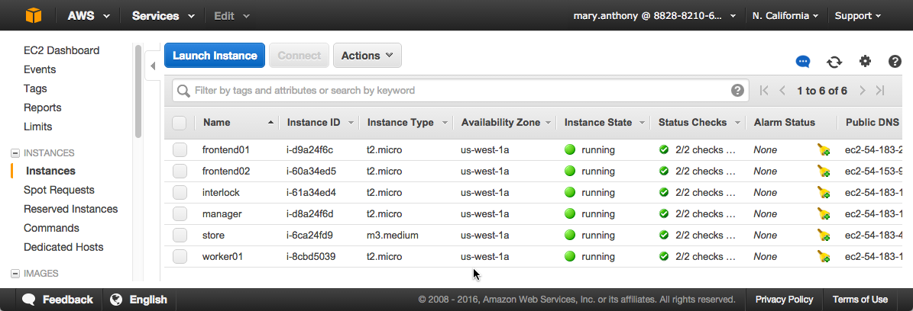
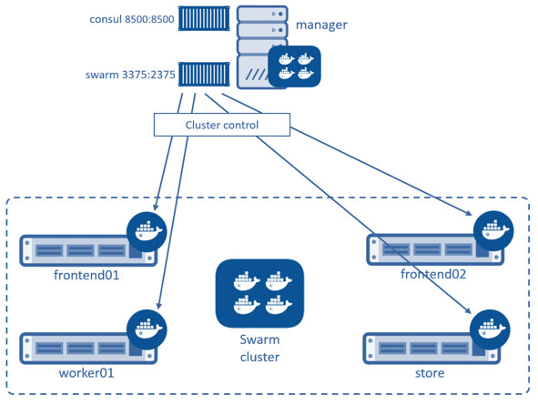
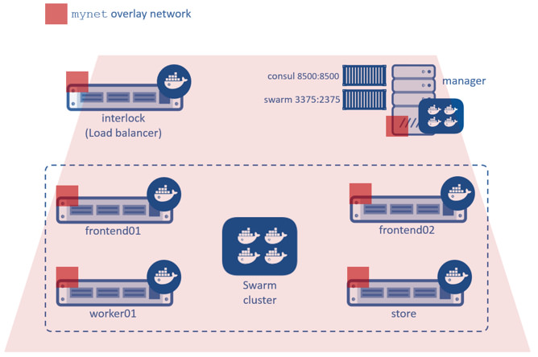

<!--[metadata]>
+++
title = "Setup cluster resources"
description = "Try Swarm at scale"
keywords = ["docker, swarm, scale, voting, application,  certificates"]
[menu.main]
parent="scale_swarm"
weight=-89
+++
<![end-metadata]-->

# Setup cluster resources

Now that [your underlying network infrastructure is built](02-deploy-infra.md),
you can deploy and configure the Swarm cluster. A host in a Swarm cluster is
called a *node*. So, these instructions refer to each AWS EC2 instances as a
node and refers to each node by the **Name** it appears as in your EC2
Dashboard**.

The steps on this page construct a Swarm cluster by:

* using Consul as the discovery backend
* join the `frontend`, `worker`
* `store` EC2 instances to the cluster
* use the `spread` scheduling strategy

You'll perform all the configuration steps from the Swarm manager node. The
manager node has access to all the instances in the cluster.

## Step 1: Construct the cluster

In this step, you create a Consul container for use as the Swarm discovery
service. The Consul backend is also used as the K/V store for the container
network that you overlay on the Swarm cluster in a later step. After you launch
the Consul container, you launch a Swarm manager container.

1. Select the `manager` node and click **Connect** to display the `ssh` command you'll need.

    

2. Open a terminal on your `manager` node with the `ssh` command.

3. Start a Consul container that listens on TCP port `8500`.

        $ docker run --restart=unless-stopped -d -p 8500:8500 -h consul progrium/consul -server -bootstrap
        Unable to find image 'progrium/consul:latest' locally
        latest: Pulling from progrium/consul
        3b4d28ce80e4: Pull complete
        ...<output snip>...
        d9125e9e799b: Pull complete
        Digest: sha256:8cc8023462905929df9a79ff67ee435a36848ce7a10f18d6d0faba9306b97274
        Status: Downloaded newer image for progrium/consul:latest
        6136de6829916430ee911cc14e3f067624fcf6d3041d404930f6dbcbf5399f7d

4. Confirm the container is running.

        $ docker ps
        IMAGE               COMMAND                  CREATED              STATUS              PORTS                                                                            NAMES
        6136de682991        progrium/consul     "/bin/start -server -"   About a minute ago   Up About a minute   53/tcp, 53/udp, 8300-8302/tcp, 8400/tcp, 0.0.0.0:8500->8500/tcp, 8301-8302/udp   goofy_jepsen

5. Start a Swarm manager container.

    This command maps port `3375` on the `manager` node to port `2375` in the
    Swarm manager container.

        $ docker run --restart=unless-stopped -d -p 3375:2375 swarm manage consul://192.168.33.11:8500/
        Unable to find image 'swarm:latest' locally
        latest: Pulling from library/swarm
        887115b43fc0: Pull complete
        ...<output snip>...
        f3f134eb6413: Pull complete
        Digest: sha256:51a8eba9502f1f89eef83e10b9f457cfc67193efc3edf88b45b1e910dc48c906
        Status: Downloaded newer image for swarm:latest
        f5f093aa9679410bee74b7f3833fb01a3610b184a530da7585c990274bd65e7e

    The Swarm manager container is the heart of your Swarm cluster. It is
    responsible for receiving all Docker commands sent to the cluster, and for
    scheduling resources against the cluster. In a real-world production
    deployment you would configure additional replica Swarm managers as
    secondaries for high availability (HA).

6.  Get information about your Docker installation.

          $ docker info
          Containers: 2
          Images: 26
          Server Version: 1.9.1
          Storage Driver: aufs
           Root Dir: /var/lib/docker/aufs
           Backing Filesystem: extfs
           Dirs: 30
           Dirperm1 Supported: true
          Execution Driver: native-0.2
          Logging Driver: json-file
          Kernel Version: 3.16.0-57-generic
          Operating System: Ubuntu 14.04.3 LTS
          CPUs: 1
          Total Memory: 992.2 MiB
          Name: manager
          ID: IISM:V4KJ:VXCT:ONN3:MFIJ:2ZLD:VI6I:UYB3:FJZ4:3O7J:FHKA:P3XS
          WARNING: No swap limit support
          Cluster store: consul://192.168.33.11:8500
          Cluster advertise: 192.168.33.11:2375

    The command information returns the information about the Engine and its
    daemon.

7. Confirm that you have the `consul` and `swarm manage` containers running.

          $ docker ps
          CONTAINER ID        IMAGE               COMMAND                  CREATED              STATUS              PORTS                                                                            NAMES
          f5f093aa9679        swarm               "/swarm manage consul"   About a minute ago   Up About a minute   0.0.0.0:3375->2375/tcp                                                           sad_goldstine
          6136de682991        progrium/consul     "/bin/start -server -"   9 minutes ago        Up 9 minutes        53/tcp, 53/udp, 8300-8302/tcp, 8301-8302/udp, 8400/tcp, 0.0.0.0:8500->8500/tcp   goofy_jepsen

7. Set the `DOCKER_HOST` environment variable.

    This ensures that the default endpoint for Docker Engine CLI commands is the
    Engine daemon running on the `manager` node.

        $ export DOCKER_HOST="tcp://192.168.33.11:3375"

8. Now that your terminal environment is set to the Swarm port, rerun the
`docker info` command.

        $ docker info
        Containers: 0
        Images: 0
        Role: primary
        Strategy: spread
        Filters: health, port, dependency, affinity, constraint
        Nodes: 0
        Kernel Version: 3.16.0-57-generic
        Operating System: linux
        CPUs: 0
        Total Memory: 0 B
        Name: f5f093aa9679

    The command is acting on the Swarm port, so it returns information about the
    entire cluster. You have a manager and no nodes.

9. While still on the `manager` node, join each node one-by-one to the cluster.

    You can run these commands to join each node from the `manager` node command
    line. The `-H` flag with the `docker` command specifies a node IP address
    and the Engine port. Each command goes over the cluster to the node's Docker
    daemon. The `join` command joins a node to the cluster and registers it with
    the Consul discovery service.  

    **frontend01**:

          docker -H=tcp://192.168.33.20:2375 run -d swarm join --advertise=192.168.33.20:2375 consul://192.168.33.11:8500/

    **frontend02**:

          docker -H=tcp://192.168.33.21:2375 run -d swarm join --advertise=192.168.33.21:2375 consul://192.168.33.11:8500/

    **worker01**:

          docker -H=tcp://192.168.33.200:2375 run -d swarm join --advertise=192.168.33.200:2375 consul://192.168.33.11:8500/

    **store**:

          docker -H=tcp://192.168.33.250:2375 run -d swarm join --advertise=192.168.33.250:2375 consul://192.168.33.11:8500/

9. Run the `docker info` command again to view your cluster with all its nodes.

          $ docker info
          Containers: 4
          Images: 4
          Role: primary
          Strategy: spread
          Filters: health, port, dependency, affinity, constraint
          Nodes: 4
           frontend01: 192.168.33.20:2375
            └ Status: Healthy
            └ Containers: 1
            └ Reserved CPUs: 0 / 1
            └ Reserved Memory: 0 B / 1.017 GiB
            └ Labels: executiondriver=native-0.2, kernelversion=3.16.0-57-generic, operatingsystem=Ubuntu 14.04.3 LTS, storagedriver=aufs
            └ Error: (none)
            └ UpdatedAt: 2016-02-14T19:02:53Z
           frontend02: 192.168.33.21:2375
            └ Status: Healthy
            └ Containers: 1
            └ Reserved CPUs: 0 / 1
            └ Reserved Memory: 0 B / 1.017 GiB
            └ Labels: executiondriver=native-0.2, kernelversion=3.16.0-57-generic, operatingsystem=Ubuntu 14.04.3 LTS, storagedriver=aufs
            └ Error: (none)
            └ UpdatedAt: 2016-02-14T19:02:58Z
           store: 192.168.33.250:2375
            └ Status: Healthy
            └ Containers: 1
            └ Reserved CPUs: 0 / 1
            └ Reserved Memory: 0 B / 3.86 GiB
            └ Labels: executiondriver=native-0.2, kernelversion=3.16.0-57-generic, operatingsystem=Ubuntu 14.04.3 LTS, storagedriver=aufs
            └ Error: (none)
            └ UpdatedAt: 2016-02-14T19:02:58Z
           worker01: 192.168.33.200:2375
            └ Status: Healthy
            └ Containers: 1
            └ Reserved CPUs: 0 / 1
            └ Reserved Memory: 0 B / 1.017 GiB
            └ Labels: executiondriver=native-0.2, kernelversion=3.16.0-57-generic, operatingsystem=Ubuntu 14.04.3 LTS, storagedriver=aufs
            └ Error: (none)
            └ UpdatedAt: 2016-02-14T19:03:21Z
          Kernel Version: 3.16.0-57-generic
          Operating System: linux
          CPUs: 4
          Total Memory: 6.912 GiB
          Name: f5f093aa9679

### Step 2: Review your work

The diagram below shows the Swarm cluster that you created.

The `manager` node is running two containers: `consul` and `swarm`. The `consul`
container is providing the Swarm discovery service. This is where nodes and
services register themselves and discover each other. The `swarm` container is
running the `swarm manage` process which makes it act as the cluster manager.
The manager is responsible for accepting Docker commands issued against the
cluster and scheduling resources on the cluster.

You mapped port 3375 on the `manager` node to port 2375 inside the `swarm`
container. As a result, Docker clients (for example the CLI) wishing to issue
commands against the cluster must send them to the `manager` node on port
3375. The `swarm` container then executes those commands against the relevant
node(s) in the cluster over port 2375.

Now that you have your Swarm cluster configured, you'll overlay the container
network that the application containers will be part of.

### Step 2: Overlay a container network

All containers that are part of the voting application should belong to a
container network called `mynet`. Container networking is a Docker Engine
feature. The` mynet` network is a overlay network type that runs on top of the
communication network.

A container network can span multiple hosts on multiple networks. As a result,
the `mynet` container network allows all the voting application containers to
easily communicate irrespective of the underlying communication network that
each node is on.

You can create the network and join the containers from any node in your VPC
that is running Docker Engine. However, best practice when using Docker Swarm is
to execute commands from the `manager` node, as this is where all management
tasks happen.

1. If you haven't already, `ssh` into a terminal on your `manager` node.

2. Get information about the network running on just the `manager` node.

    You do this by passing the `-H` flag to restrict the Engine CLI to just
      the manager node.

        $ docker -H=tcp://192.168.33.11:2375 network ls
        NETWORK ID          NAME                DRIVER
        d01e8f0303a9        none                null                
        bab7a9c42a23        host                host                
        12fd2a115d85        bridge              bridge   

3.  Now, run the same command to get cluster information.

    Provided you set `export DOCKER_HOST="tcp://192.168.33.11:3375"``, the
    command directs to the Swarm port and returns information from each node in
    the cluster.

          $ docker network ls
          NETWORK ID          NAME                DRIVER
          82ce2adce6a7        store/bridge        bridge              
          c3ca43d2622d        store/host          host                
          d126c4b1e092        frontend01/host     host                
          6ea89a1a5b6a        frontend01/bridge   bridge              
          d3ddb830d7f5        frontend02/host     host                
          44f238353c14        frontend02/bridge   bridge              
          c500baec447e        frontend02/none     null                
          77897352f138        store/none          null                
          8060bd575770        frontend01/none     null                
          429e4b8c2c8d        worker01/bridge     bridge              
          57c5001aca83        worker01/none       null                
          2101103b8494        worker01/host       host        

4. Create the overlay network with the `docker network` command

        $ docker network create --driver overlay mynet

5. Repeat the two network commands again to see how the network list has changed.   

        docker network ls
        docker -H=tcp://192.168.33.11:2375 network ls

    As all Swarm nodes in your environment are configured to use the Consul
    discovery service at `consul://192.168.33.11:8500`, they all should see the
    new overlay network. Verify this with the next step.

3. Try running a network command on an individual node, for example to run it on
the `frontend01` node:

          docker -H=tcp://192.168.33.20:2375 network ls

    You should see an entry for the `mynet` network using the `overlay` driver
    as shown above. You would get the same output if your ran the command from
    node's command line.

## Step 4: Review your work

The diagram below shows the complete cluster configuration including the overlay
container network, `mynet`. The `mynet` is shown as red and is available to all
Docker hosts using the Consul discovery backend. Later in the procedure you will
connect containers to this network.

The `swarm` and `consul` containers on the `manager` node are not attached to
the `mynet` overlay network. These containers are running on `manager` nodes
default bridge network. To verify this try using these two commands:

      docker -H=tcp://192.168.33.11:2375 network inspect bridge
      docker -H=tcp://192.168.33.11:2375 network inspect mynet

You should find two containers running on the `manager` node's `bridge` network
but nothing yet on the `mynet` network.

## Next Step

Your Swarm cluster is now built and you are ready to [build and run the voting
application](04-deploy-app.md) on it.
