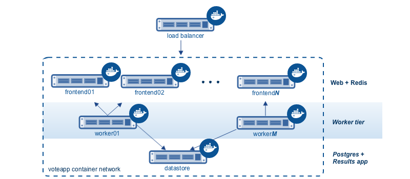
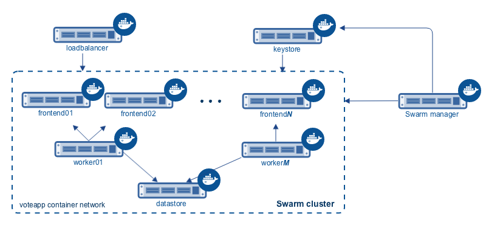

<!--[metadata]>
+++
aliases = ["/swarm/swarm_at_scale/about/"]
title = "Learn the application architecture"
description = "Try Swarm at scale"
keywords = ["docker, swarm, scale, voting, application, archiecture"]
[menu.main]
parent="scale_swarm"
weight=-99
+++
<![end-metadata]-->

# Learn the application architecture

On this page, you learn about the Swarm at scale example.  Make sure you have
read through [the introduction](index.md) to get an idea of the skills and time
required first.

## Learn the example back story

Your company is a pet food company that has bought a commercial during the
Superbowl. The commercial drives viewers to a web survey that asks users to vote
&ndash; cats or dogs. You are developing the web survey.

Your survey must ensure that millions of people can vote concurrently without
your website becoming unavailable. You don't need real-time results, a company
press release announces the results. However, you do need confidence that every
vote is counted.

## Understand the application architecture

The voting application is composed of several microservices. It uses a parallel
web frontend that sends jobs to asynchronous background workers. The
application's design can accommodate arbitrarily large scale. The diagram below
shows the appliation's high level architecture:

All the servers are running Docker Engine. The entire application is fully
"dockerized" in that all services are running inside of containers.

The frontend consists of an load balancer with *N* frontend instances. Each
frontend consists of a web server and a Redis queue. The load balancer can
handle an arbitrary number of web containers behind it (`frontend01`-
`frontendN`). The web containers run a simple Python application that takes a
vote between two options. It queues the votes to a Redis container running on
the datastore.

Behind the frontend is a worker tier which runs on separate nodes. This tier:

* scans the Redis containers
* dequeues votes
* deduplicates votes to prevent double voting
* commits the results to a Postgres database

Just like the frontend, the worker tier can also scale arbitrarily. The worker
count and frontend count are independent from each other.

The applications dockerized microservices are deployed to a container network.
Container networks are a feature of Docker Engine that allows communication
between multiple containers across multiple Docker hosts.

## Swarm Cluster Architecture

To support the application, the design calls for a Swarm cluster with a single
Swarm manager and four nodes as shown below.

All four nodes in the cluster are running the Docker daemon, as is the Swarm
manager and the load balancer. The Swarm manager is part of the cluster and is
considered out of band for the application. A single host running the Consul
server acts as a keystore for both Swarm discovery and for the container
network. The load balancer could be placed inside of the cluster, but for this
demonstration it is not.

After completing the example and deploying your application, this
is what your environment should look like.

As the previous diagram shows, each node in the cluster runs the following containers:

- `frontend01`:
  - Container: voting-app 
  - Container: Swarm agent
- `frontend02`:
  - Container: voting-app
  - Container: Swarm agent
- `worker01`:
  - Container: voting-app-worker
  - Container: Swarm agent
- `dbstore`:
  - Container: voting-app-result-app
  - Container: db (Postgres 9.4)
  - Container: redis
  - Container: Swarm agent

After deploying the application, you'll configure your local system so that you
can test the application from your local browser. In production, of course, this
step wouldn't be needed.

## Next step

Now that you understand the application architecture, you need to deploy a
network configuration that can support it. In the next step, you
[deploy network infrastructure](deploy-infra.md) for use in this sample.
