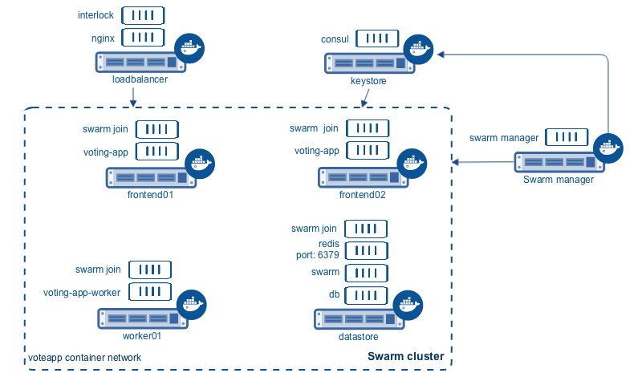
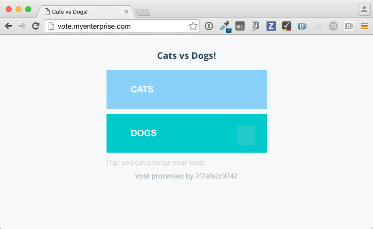
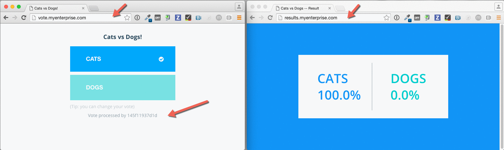

<!--[metadata]>
+++
aliases = ["/swarm/swarm_at_scale/04-deploy-app/"]
title = "Deploy the application"
description = "Try Swarm at scale"
keywords = ["docker, swarm, scale, voting, application,  certificates"]
[menu.main]
parent="scale_swarm"
weight=-80
+++
<![end-metadata]-->

# Deploy the application

You've [deployed the load balancer, the discovery backend, and a Swarm
cluster](deploy-infra.md) so now you can build and deploy the voting application
itself. You do this by starting a number of "dockerized applications" running in
containers.

The diagram below shows the final application configuration including the overlay
container network, `voteapp`.



In this procedure you will connect containers to this network. The `voteapp`
network is available to all Docker hosts using the Consul discovery backend.
Notice that the `interlock`, `nginx`, `consul`, and `swarm manager` containers
on are not part of the `voteapp` overlay container network.

## Task 1. Set up volume and network

This application relies on both an overlay container network and a container
volume. The Docker Engine provides these two features. You'll create them both
on the Swarm `manager` instance.

1. Direct your local environmen to the Swarm manager host.

    ```bash
    $ eval $(docker-machine env manager)
    ```

    You can create the network on an cluster node at the network is visible on
    them all.

2. Create the `voteapp` container network.

    ```bash
    $ docker network create -d overlay voteapp
    ```

3. Switch to the db store.

    ```bash
    $ eval $(docker-machine env dbstore)
    ```

4. Verify you can see the new network from the dbstore node.

    ```bash
    $ docker network ls
    NETWORK ID          NAME                DRIVER
    e952814f610a        voteapp             overlay
    1f12c5e7bcc4        bridge              bridge
    3ca38e887cd8        none                null
    3da57c44586b        host                host
    ```

3. Create a container volume called `db-data`.

    ```bash
    $ docker volume create --name db-data
    ```

## Task 2. Start the containerized microservices

At this point, you are ready to start the component microservices that make up
the application. Some of the application's containers are launched from existing
images pulled directly from Docker Hub. Other containers are launched from
custom images you must build. The list below shows which containers use custom
images and which do not:

- Load balancer container: stock image (`ehazlett/interlock`)
- Redis containers: stock image (official `redis` image)
- Postgres (PostgreSQL) containers: stock image (official `postgres` image)
- Web containers: custom built image
- Worker containers: custom built image
- Results containers: custom built image

You can launch these containers from any host in the cluster using the commands
in this section. Each command includs a `-H `flag so that they execute against
the Swarm manager.

The commands also all use the `-e` flag which is a Swarm constraint. The
constraint tells the manager to look for a node with a matching function label.
You set established the labels when you created the nodes. As you run each
command below, look for the value constraint.

1. Start a Postgres database container.

    ```bash
    $ docker -H $(docker-machine ip manager):3376 run -t -d \
    -v db-data:/var/lib/postgresql/data \
    -e constraint:com.function==dbstore \
    --net="voteapp" \
    --name db postgres:9.4
    ```

6. Start the Redis container.

    ```bash
    $ docker -H $(docker-machine ip manager):3376 run -t -d \
    -p 6379:6379 \
    -e constraint:com.function==dbstore \
    --net="voteapp" \
    --name redis redis
    ```

    The `redis` name is important so don't change it.

7. Start the worker application

    ```bash
    $ docker -H $(docker-machine ip manager):3376 run -t -d \
    -e constraint:com.function==worker01 \
    --net="voteapp" \
    --net-alias=workers \
    --name worker01 docker/example-voting-app-worker
    ```

6. Start the results application.

    ```bash
    $ docker -H $(docker-machine ip manager):3376 run -t -d \
    -p 80:80 \
    --label=interlock.hostname=results \
    --label=interlock.domain=myenterprise.com \
    -e constraint:com.function==dbstore \
    --net="voteapp" \
    --name results-app docker/example-voting-app-result-app
    ```

7. Start voting application twice, on each frontend node.

    ```bash
    $ docker -H $(docker-machine ip manager):3376 run -t -d \
    -p 80:80 \
    --label=interlock.hostname=vote \
    --label=interlock.domain=myenterprise.com \
    -e constraint:com.function==frontend01 \
    --net="voteapp" \
    --name voting-app01 docker/example-voting-app-voting-app
    ```

    And again on the other frontend node.

    ```bash
    $ docker -H $(docker-machine ip manager):3376 run -t -d \
    -p 80:80 \
    --label=interlock.hostname=vote \
    --label=interlock.domain=myenterprise.com \
    -e constraint:com.function==frontend02 \
    --net="voteapp" \
    --name voting-app02 docker/example-voting-app-voting-app
    ```


## Task 3. Check your work and update /etc/hosts

In this step, you check your work to make sure the Nginx configuration recorded
the containers correctly. You'll update your local systems `/etc/hosts` file to
allow you to take advantage of the loadbalancer.

1. Change to the `loadbalancer` node.

    ```bash
    $ eval $(docker-machine env loadbalancer)
    ```
2. Check your work by reviewing the configuration of nginx.

    ```html
    $ docker exec interlock cat /etc/conf/nginx.conf
    ... output snipped ...

    upstream results.myenterprise.com {
        zone results.myenterprise.com_backend 64k;

        server 192.168.99.111:80;

    }
    server {
        listen 80;

        server_name results.myenterprise.com;

        location / {
            proxy_pass http://results.myenterprise.com;
        }
    }
    upstream vote.myenterprise.com {
        zone vote.myenterprise.com_backend 64k;

        server 192.168.99.109:80;
        server 192.168.99.108:80;

    }
    server {
        listen 80;

        server_name vote.myenterprise.com;

        location / {
            proxy_pass http://vote.myenterprise.com;
        }
    }

    include /etc/conf/conf.d/*.conf;
    }
    ```

  The `http://vote.myenterprise.com` site configuration should point to either
  frontend node. Requests to `http://results.myenterprise.com` go just to the
  single `dbstore` node where the `example-voting-app-result-app` is running.

8. On your local host, edit `/etc/hosts` file add the resolution for both these
sites.

9. Save and close the `/etc/hosts` file.

10. Restart the `nginx` container.

    Manual restart is required because the current Interlock server is not forcing an
    Nginx configuration reload.

    ```bash
    $ docker restart nginx
    ```

## Task 4. Test the application

Now, you can test your application.

1. Open a browser and navigate to the `http://vote.myenterprise.com` site.

    You should see something similar to the following:

    

2. Click on one of the two voting options.
3. Navigate to the `http://results.myenterprise.com` site to see the results.
4. Try changing your vote.

    You'll see both sides change as you switch your vote.

    

## Extra Credit: Deployment with Docker Compose

Up to this point, you've deployed each application container individually. This
can be cumbersome espeically because their are several different containers and
starting them is order dependent. For example, that database should be running
before the worker.

Docker Compose let's you define your microservice containers and their
dependencies in a Compose file. Then, you can use the Compose file to start all
the containers at once. This extra credit

1. Before you begin, stop all the containers you started.

    a. Set the host to the manager.

        $ DOCKER_HOST=$(docker-machine ip manager):3376

    b. List all the application continers on the Swarm.

    c. Stop and remove each container.

2. Try to create Compose file on your own by reviewing the tasks in this tutorial.

    <a href="http://192.168.99.100:8000/compose/compose-file/#entrypoint" target="_blank">The
    version 2 Compose file format</a> is the best to use. Translate each `docker
    run` command into a service in the `docker-compose.yml` file. For example,
    this command:

    ```bash
    $ docker -H $(docker-machine ip manager):3376 run -t -d \
    -e constraint:com.function==worker01 \
    --net="voteapp" \
    --net-alias=workers \
    --name worker01 docker/example-voting-app-worker
    ```

    Becomes this in a Compose file.

    ```
    worker:
      image: docker/example-voting-app-worker
      networks:
        voteapp:
          aliases:
          - workers
    ```

    In general, Compose starts services in reverse order they appear in the file.
    So, if you want a service to start before all the others, make it the last
    service in the file file.  This applciation relies on a volume and a network,
    declare those at the bottom of the file.

3. Check your work against <a href="../docker-compose.yml" target="_blank">this
result file</a>

4. When you are satisifed, save the `docker-compose.yml` file to your system.

5. Set  `DOCKER_HOST` to the Swarm manager.

    ```bash
    $ DOCKER_HOST=$(docker-machine ip manager):3376
    ```

6. In the same directory as your `docker-compose.yml` file, start the services.

    ```bash
    $ docker-compose up -d
    Creating network "scale_voteapp" with the default driver
    Creating volume "scale_db-data" with default driver
    Pulling db (postgres:9.4)...
    worker01: Pulling postgres:9.4... : downloaded
    dbstore: Pulling postgres:9.4... : downloaded
    frontend01: Pulling postgres:9.4... : downloaded
    frontend02: Pulling postgres:9.4... : downloaded
    Creating db
    Pulling redis (redis:latest)...
    dbstore: Pulling redis:latest... : downloaded
    frontend01: Pulling redis:latest... : downloaded
    frontend02: Pulling redis:latest... : downloaded
    worker01: Pulling redis:latest... : downloaded
    Creating redis
    Pulling worker (docker/example-voting-app-worker:latest)...
    dbstore: Pulling docker/example-voting-app-worker:latest... : downloaded
    frontend01: Pulling docker/example-voting-app-worker:latest... : downloaded
    frontend02: Pulling docker/example-voting-app-worker:latest... : downloaded
    worker01: Pulling docker/example-voting-app-worker:latest... : downloaded
    Creating scale_worker_1
    Pulling voting-app (docker/example-voting-app-voting-app:latest)...
    dbstore: Pulling docker/example-voting-app-voting-app:latest... : downloaded
    frontend01: Pulling docker/example-voting-app-voting-app:latest... : downloaded
    frontend02: Pulling docker/example-voting-app-voting-app:latest... : downloaded
    worker01: Pulling docker/example-voting-app-voting-app:latest... : downloaded
    Creating scale_voting-app_1
    Pulling result-app (docker/example-voting-app-result-app:latest)...
    dbstore: Pulling docker/example-voting-app-result-app:latest... : downloaded
    frontend01: Pulling docker/example-voting-app-result-app:latest... : downloaded
    frontend02: Pulling docker/example-voting-app-result-app:latest... : downloaded
    worker01: Pulling docker/example-voting-app-result-app:latest... : downloaded
    Creating scale_result-app_1
    ```

9. Use the `docker ps` command to see the containers on the Swarm cluster.

    ```bash
    $ docker -H $(docker-machine ip manager):3376 ps
    CONTAINER ID        IMAGE                                  COMMAND                  CREATED             STATUS              PORTS                            NAMES
    b71555033caa        docker/example-voting-app-result-app   "node server.js"         6 seconds ago       Up 4 seconds        192.168.99.104:32774->80/tcp     frontend01/scale_result-app_1
    cf29ea21475d        docker/example-voting-app-worker       "/usr/lib/jvm/java-7-"   6 seconds ago       Up 4 seconds                                         worker01/scale_worker_1
    98414cd40ab9        redis                                  "/entrypoint.sh redis"   7 seconds ago       Up 5 seconds        192.168.99.105:32774->6379/tcp   frontend02/redis
    1f214acb77ae        postgres:9.4                           "/docker-entrypoint.s"   7 seconds ago       Up 5 seconds        5432/tcp                         frontend01/db
    1a4b8f7ce4a9        docker/example-voting-app-voting-app   "python app.py"          7 seconds ago       Up 5 seconds        192.168.99.107:32772->80/tcp     dbstore/scale_voting-app_1
    ```

    When you started the services manually, you had a
    `voting-app` instances running on two frontend servers. How many
    do you have now?

10. Scale your application up by adding some `voting-app` instances.

    ```bash
    $ docker-compose scale voting-app=3
    Creating and starting 2 ... done
    Creating and starting 3 ... done
    ```

    After you scale up, list the containers on the cluster again.

7. Change to the `loadbalancer` node.

    ```bash
    $ eval $(docker-machine env loadbalancer)
    ```

7. Restart the Nginx server.

    ```bash
    $ docker restart nginx
    ```
8. Check your work again by visiting the `http://vote.myenterprise.com` and
`http://results.myenterprise.com` again.

9. You can view the logs on an indvidual container.

  ```bash
  $ docker logs scale_voting-app_1
   * Running on http://0.0.0.0:80/ (Press CTRL+C to quit)
   * Restarting with stat
   * Debugger is active!
   * Debugger pin code: 285-809-660
  192.168.99.103 - - [11/Apr/2016 17:15:44] "GET / HTTP/1.0" 200 -
  192.168.99.103 - - [11/Apr/2016 17:15:44] "GET /static/stylesheets/style.css HTTP/1.0" 304 -
  192.168.99.103 - - [11/Apr/2016 17:15:45] "GET /favicon.ico HTTP/1.0" 404 -
  192.168.99.103 - - [11/Apr/2016 17:22:24] "POST / HTTP/1.0" 200 -
  192.168.99.103 - - [11/Apr/2016 17:23:37] "POST / HTTP/1.0" 200 -
  192.168.99.103 - - [11/Apr/2016 17:23:39] "POST / HTTP/1.0" 200 -
  192.168.99.103 - - [11/Apr/2016 17:23:40] "POST / HTTP/1.0" 200 -
  192.168.99.103 - - [11/Apr/2016 17:23:41] "POST / HTTP/1.0" 200 -
  192.168.99.103 - - [11/Apr/2016 17:23:43] "POST / HTTP/1.0" 200 -
  192.168.99.103 - - [11/Apr/2016 17:23:44] "POST / HTTP/1.0" 200 -
  192.168.99.103 - - [11/Apr/2016 17:23:46] "POST / HTTP/1.0" 200 -
  ```

  This log shows the activity on one of the active voting application containers.

## Next steps

Congratulations. You have successfully walked through manually deploying a
microservice-based application to a Swarm cluster. Of course, not every
deployment goes smoothly. Now that you've learned how to successfully deploy an
application at scale, you should learn [what to consider when troubleshooting
large applications running on a Swarm cluster](troubleshoot.md).
