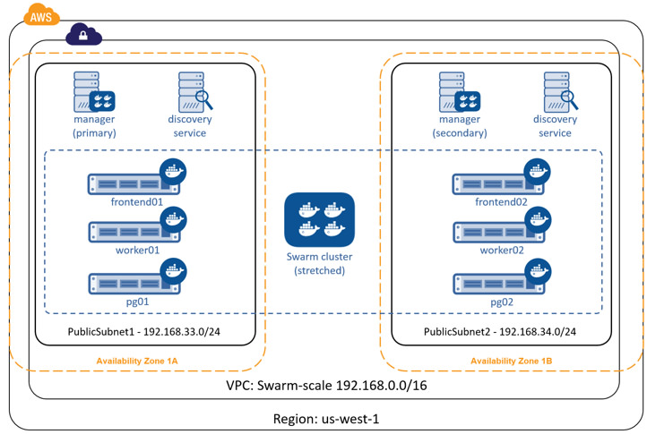

It's a fact of life that things fail. With this in mind, it's important to
understand what happens when failures occur and how to mitigate them. The
following sections cover different failure scenarios:

- [Swarm manager failures](troubleshoot.md#swarm-manager-failures)
- [Consul (discovery backend) failures](troubleshoot.md#consul-discovery-backend-failures)
- [Interlock load balancer failures](troubleshoot.md#interlock-load-balancer-failures)
- [Web (voting-app) failures](troubleshoot.md#web-voting-app-failures)
- [Redis failures](troubleshoot.md#redis-failures)
- [Worker (vote-worker) failures](troubleshoot.md#worker-vote-worker-failures)
- [Postgres failures](troubleshoot.md#postgres-failures)
- [Results-app failures](troubleshoot.md#results-app-failures)
- [Infrastructure failures](troubleshoot.md#infrastructure-failures)

## Swarm manager failures

In its current configuration, the swarm cluster only has single manager
container running on a single node. If the container exits or the node fails,
you cannot administer the cluster until you either fix it, or
replace it.

If the failure is the swarm manager container unexpectedly exiting, Docker
automatically attempts to restart it. This is because the container was started
with the `--restart=unless-stopped` switch.

While the swarm manager is unavailable, the application continues to work in
its current configuration. However, you cannot provision more nodes
or containers until you have a working swarm manager.

Docker Swarm supports high availability for swarm managers. This allows a single
swarm cluster to have two or more managers. One manager is elected as the
primary manager and all others operate as secondaries. In the event that the
primary manager fails, one of the secondaries is elected as the new primary, and
cluster operations continue gracefully. If you are deploying multiple swarm
managers for high availability, you should consider spreading them across
multiple failure domains within your infrastructure.

## Consul (discovery backend) failures

The swarm cluster that you have deployed has a single Consul container on a
single node performing the cluster discovery service. In this setup, if the
Consul container exits or the node fails, the application continues to
operate in its current configuration. However, certain cluster management
operations fail. These include registering new containers in the cluster
and making lookups against the cluster configuration.

If the failure is the `consul` container unexpectedly exiting, Docker
automatically attempts to restart it. This is because the container was started
with the `--restart=unless-stopped` switch.

The `Consul`, `etcd`, and `Zookeeper` discovery service backends support various
options for high availability. These include Paxos/Raft quorums. You should
follow existing best practices for deploying HA configurations of your chosen
discover service backend. If you are deploying multiple discovery service
instances for high availability, you should consider spreading them across
multiple failure domains within your infrastructure.

If you operate your swarm cluster with a single discovery backend service and
this service fails and is unrecoverable, you can start a new empty instance of
the discovery backend and the swarm agents on each node in the cluster
repopulate it.

### Handling failures

There are many reasons why containers can fail. However, Swarm does not attempt
to restart failed containers.

One way to automatically restart failed containers is to explicitly start them
with the `--restart=unless-stopped` flag. This tells the local Docker daemon
to attempt to restart the container if it unexpectedly exits. This only
works in situations where the node hosting the container and its Docker daemon
are still up. This cannot restart a container if the node hosting it has failed,
or if the Docker daemon itself has failed.

Another way is to have an external tool (external to the cluster) monitor the
state of your application, and make sure that certain service levels are
maintained. These service levels can include things like "have at least 10 web
server containers running". In this scenario, if the number of web containers
drops below 10, the tool attempts to start more.

In our simple voting-app example, the front-end is scalable and serviced by a
load balancer. In the event that one of the two web containers fails (or the
node that is hosting it fails), the load balancer stops routing requests to it and
sends all requests to the surviving web container. This solution is highly scalable
meaning you can have up to *n* web containers behind the load balancer.

## Interlock load balancer failures

The environment that you have provisioned has a single
[interlock](https://github.com/ehazlett/interlock) load balancer container
running on a single node. In this setup, if the container exits or node fails,
the application cannot service incoming requests and the application is
unavailable.

If the failure is the `interlock` container unexpectedly exiting, Docker
automatically attempts to restart it. This is because the container was started
with the `--restart=unless-stopped` switch.

It is possible to build an HA Interlock load balancer configuration. One such
way is to have multiple Interlock containers on multiple nodes. You can then use
DNS round robin, or other technologies, to load balance across each Interlock
container. That way, if one Interlock container or node goes down, the others
continue to service requests.

If you deploy multiple interlock load balancers, you should consider spreading
them across multiple failure domains within your infrastructure.

## Web (voting-app) failures

The environment that you have configured has two voting-app containers running
on two separate nodes. They operate behind an Interlock load balancer that
distributes incoming connections across both.

In the event that one of the web containers or nodes fails, the load balancer
starts directing all incoming requests to surviving instance. Once the
failed instance is back up, or a replacement is added, the load balancer
adds it to the configuration and starts sending a portion of the incoming requests
to it.

For highest availability you should deploy the two frontend web services
(`frontend01` and `frontend02`) in different failure zones within your
infrastructure. You should also consider deploying more.

## Redis failures

If the `redis` container fails, its partnered `voting-app` container does
not function correctly. The best solution in this instance might be to configure
health monitoring that verifies the ability to write to each Redis instance. If
an unhealthy `redis` instance is encountered, remove the `voting-app` and
`redis` combination and attempt remedial actions.

## Worker (vote-worker) failures

If the worker container exits, or the node that is hosting it fails, the redis
containers queue votes until the worker container comes back up. This
situation can prevail indefinitely, though a worker needs to come back at some
point and process the votes.

If the failure is the `worker01` container unexpectedly exiting, Docker
automatically attempts to restart it. This is because the container was started
with the `--restart=unless-stopped` switch.

## Postgres failures

This application does not implement any for of HA or replication for Postgres.
Therefore losing the Postgres container would cause the application to fail and
potential lose or corrupt data. A better solution would be to implement some
form of Postgres HA or replication.

## Results-app failures

If the results-app container exits, you cannot browse to the results of the poll
until the container is back up and running. Results continue to be collected and
counted, but you can't view results until the container is back up and running.

The results-app container was started with the `--restart=unless-stopped` flag
meaning that the Docker daemon automatically attempts to restart it unless
it was administratively stopped.

## Infrastructure failures

There are many ways in which the infrastructure underpinning your applications
can fail. However, there are a few best practices that can be followed to help
mitigate and offset these failures.

One of these is to deploy infrastructure components over as many failure domains
as possible. On a service such as AWS, this often translates into balancing
infrastructure and services across multiple AWS Availability Zones (AZ) within a
Region.

To increase the availability of our swarm cluster you could:

* Configure the swarm manager for HA and deploy HA nodes in different AZs
* Configure the Consul discovery service for HA and deploy HA nodes in different AZs
* Deploy all scalable components of the application across multiple AZs

This configuration is shown in the diagram below.

This allows us to lose an entire AZ and still have our cluster and
application operate.

But it doesn't have to stop there. Some applications can be balanced across AWS
Regions. It's even becoming possible to deploy services across cloud providers,
or have balance services across public cloud providers and your on premises date
centers!

The diagram below shows parts of the application and infrastructure deployed
across AWS and Microsoft Azure. But you could just as easily replace one of
those cloud providers with your own on premises data center. In these scenarios,
network latency and reliability is key to a smooth and workable solution.

## Related information

The application in this example could be deployed on Docker Universal Control
Plane (UCP) which is part of Docker Data Center. To try the application on UCP in
your environment, [request a free trial](https://www.docker.com/products/docker-datacenter). Other
useful documentation:

* [Plan for Swarm in production](../plan-for-production.md)
* [Swarm and container networks](../networking.md)
* [High availability in Docker Swarm](../multi-manager-setup.md)
